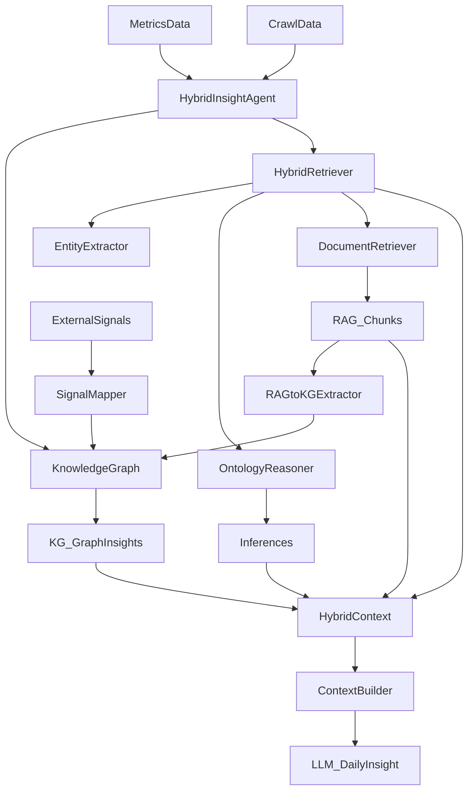

## 목표

- **KG를 ‘참조’에서 ‘생성/활용/검증’ 레이어로 승격**: RAG·External Signal에서 추출한 구조 지식을 KG에 넣고(저장), Reasoner/ContextBuilder가 그것을 근거로 활용(활용), LLM 출력이 KG/RAG 근거를 인용하도록(검증) 개선.

## 출력 포맷 요구사항(출처 각주/참고자료)

- **본문 인용**: 문장/불릿 끝에 `[1]`, `[2]`처럼 **숫자 인용**을 붙임(복수 근거는 `[3][4]`).
- **문서 마지막**: `## 참고자료` 섹션에 번호 매핑을 제공.
  - **RAG 문서**: `문서명(제목) - 파일경로 - doc_id - chunk_id` 중심으로 표기
  - **External Signal**: `매체/플랫폼 - 제목 - URL - 수집일(또는 기간)` 표기
  - **KG 근거(선택)**: `관계 요약(예: LANEIGE competesWith COSRX, category=lip_care)` + 생성 출처(source_doc/source_signal) 표기

## 현 계획(기존안)에서 수정이 필요한 부분(핵심)

- **존재하지 않는 RelationType 사용**: 기존안의 `TREND_KEYWORD`, `HAS_VOLUME`, `APPLIES_TO`, `HAS_EXTERNAL_TRAFFIC`, `HAS_PRICE_CHANGE` 등은 현재 Enum에 없음. 실제 사용 가능 타입은 [`src/domain/entities/relations.py`](src/domain/entities/relations.py)( /Users/leedongwon/.cursor/worktrees/AMORE-RAG-ONTOLOGY-HYBRID_AGENT/abe/src/domain/entities/relations.py )의 `RelationType.HAS_TREND`, `RelationType.REQUIRES_ACTION`, `RelationType.HAS_STATE` 등을 기준으로 재설계 필요.
- **KG.query의 properties_filter 가정**: [`src/ontology/knowledge_graph.py`](src/ontology/knowledge_graph.py)( /Users/leedongwon/.cursor/worktrees/AMORE-RAG-ONTOLOGY-HYBRID_AGENT/abe/src/ontology/knowledge_graph.py )의 `query()`는 `subject/predicate/object_/min_confidence`만 지원. 시간 필터링은 (1) `Relation.valid_from/valid_to` 기반으로 query를 확장하거나 (2) 히스토리 계산은 SQLite 등 외부 저장에서 처리하도록 분리해야 함.
- **RAG 결과 메타데이터 부족**: [`src/rag/retriever.py`](src/rag/retriever.py)( /Users/leedongwon/.cursor/worktrees/AMORE-RAG-ONTOLOGY-HYBRID_AGENT/abe/src/rag/retriever.py )의 `search()` 결과 `metadata`에 `keywords/content_type/chunk_id` 등이 빠져 있어, “Signal↔RAG 매핑”과 “RAG→KG 추출” 품질이 떨어짐.
- **ContextBuilder에 KG 전달 누락**: [`src/rag/context_builder.py`](src/rag/context_builder.py)( /Users/leedongwon/.cursor/worktrees/AMORE-RAG-ONTOLOGY-HYBRID_AGENT/abe/src/rag/context_builder.py )는 `knowledge_graph`를 받지만, [`src/agents/hybrid_insight_agent.py`](src/agents/hybrid_insight_agent.py)( /Users/leedongwon/.cursor/worktrees/AMORE-RAG-ONTOLOGY-HYBRID_AGENT/abe/src/agents/hybrid_insight_agent.py )의 `_generate_daily_insight()`에서 넘기지 않아 카테고리 계층/제품-카테고리 컨텍스트가 프롬프트에 제대로 포함되지 않음.
- **기존 계획 문서 자체 품질 이슈**: “구현 우선순위” 섹션이 마크다운 표로 되어 있음(계획 도구 렌더링 제약) + 일부 라인이 과도한 공백으로 오염됨 → 새 계획안에서 정리.

## 개선 후 데이터 흐름(요약)

## 추가로 “할 만한 것”(기존안에 없거나 약했던 것)

- **근거 인용(출처 라벨링)**: 인사이트/액션마다 `RAG chunk id + doc_id + title` 또는 `KG relation snapshot`을 붙여 “왜 이 결론이 나왔는지”를 UI/리포트에서 바로 확인 가능.
- **품질 게이트(저비용)**: LLM 결과를 규칙 기반으로 후처리(금지어/과잉 단정/수치 불일치) + KG/RAG 근거 없는 문장에 “근거 부족” 태그 부여.
- **프로파일/스냅샷 설계**: KG를 매 실행 “누적”할지 “오늘 스냅샷”으로 리셋할지 전략 선택(누적 시 max_triples, FIFO 삭제 정책 영향 큼).

## 구현 포인트(파일별)

- [`src/agents/hybrid_insight_agent.py`](src/agents/hybrid_insight_agent.py)( /Users/leedongwon/.cursor/worktrees/AMORE-RAG-ONTOLOGY-HYBRID_AGENT/abe/src/agents/hybrid_insight_agent.py )
  - LLM 프롬프트 생성 시 `ContextBuilder.build(..., knowledge_graph=self.kg)` 전달
  - `_extract_action_items()`를 `hybrid_context`까지 받아 RAG 기반 액션 포함
  - **인사이트 템플릿에 출처 인용 규칙 추가**: 본문에 `[n]` 인용을 강제하고, 마지막에 `## 참고자료`를 생성하도록 프롬프트/후처리 추가
  - (선택) `kg_graph_insights`, `temporal_insights`를 results에 추가

- [`src/rag/hybrid_retriever.py`](src/rag/hybrid_retriever.py)( /Users/leedongwon/.cursor/worktrees/AMORE-RAG-ONTOLOGY-HYBRID_AGENT/abe/src/rag/hybrid_retriever.py )
  - `_build_inference_context()`에 `trend_keywords`/`signal_keywords` 등 KG/Signal 기반 키 추가
  - KG 그래프 탐색 결과를 `HybridContext.ontology_facts`에 새로운 `type`으로 첨부(구조화)

- [`src/rag/retriever.py`](src/rag/retriever.py)( /Users/leedongwon/.cursor/worktrees/AMORE-RAG-ONTOLOGY-HYBRID_AGENT/abe/src/rag/retriever.py )
  - `search()` 결과 메타데이터에 `doc_type`, `doc_id`, `title` 외에 `keywords`, `content_type`, `chunk_id`(또는 id), `source_filename` 등을 포함
  - (선택) `freshness/valid_period`을 점수 가중치에 반영

- [`src/ontology/knowledge_graph.py`](src/ontology/knowledge_graph.py)( /Users/leedongwon/.cursor/worktrees/AMORE-RAG-ONTOLOGY-HYBRID_AGENT/abe/src/ontology/knowledge_graph.py )
  - (선택) 시간 필터 지원을 위해 `query_at(timestamp)` 또는 `query(..., valid_at=...)` 추가
  - (선택) `clone()`/`snapshot()` 유틸 추가(시나리오/비교 분석용)

## 실행 순서(권장)

- Quick win(프롬프트 품질) → RAG 메타데이터 풍부화 → RAG/Signal → KG 구조화 → KG 기반 규칙/인사이트 → 시간/시나리오(중장기)
