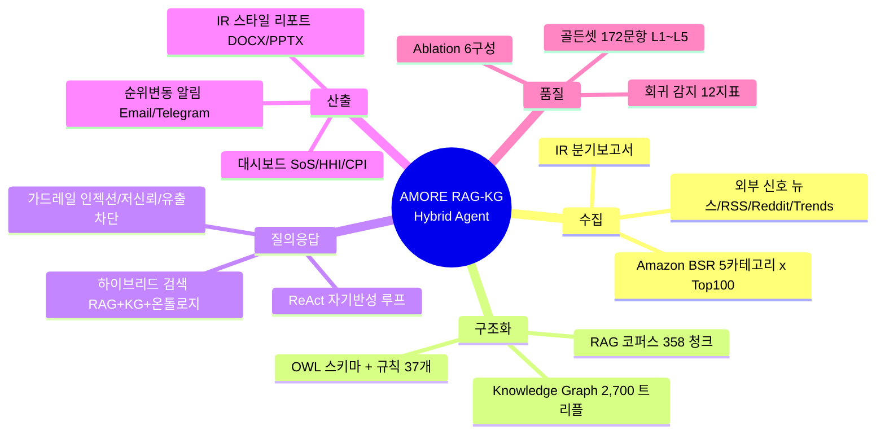

# PRD — AMORE Pacific RAG-KG Hybrid Agent

> Amazon US 시장에서 LANEIGE 브랜드 경쟁력을 매일 추적·해석하는 자율 AI 에이전트
>
> 문서 버전 v1.0 · 기준 커밋 `a46ce76` · 작성 2026-09-09
> 수치 근거: `PORTFOLIO_FACTS.md`(항목별 검증 라벨), `eval/baselines/v8.1-2026-08-30/`, `docs/experiments/`

---

## 목차

1. [배경과 문제 정의](#1-배경과-문제-정의)
2. [제품 목표와 성공 지표](#2-제품-목표와-성공-지표)
3. [사용자와 유스케이스](#3-사용자와-유스케이스)
4. [범위](#4-범위)
5. [기능 요구사항](#5-기능-요구사항)
6. [비기능 요구사항](#6-비기능-요구사항)
7. [시스템 아키텍처](#7-시스템-아키텍처)
8. [데이터 요구사항](#8-데이터-요구사항)
9. [품질 보증 — 평가 체계](#9-품질-보증--평가-체계)
10. [측정 결과와 개선 이력](#10-측정-결과와-개선-이력)
11. [리스크와 대응](#11-리스크와-대응)
12. [로드맵](#12-로드맵)
13. [부록](#13-부록)

---

## 핵심 요약

> **한 문장**: 매일 22시 Amazon 베스트셀러 500개를 수집해 지식 그래프로 구조화하고, RAG·KG·규칙 추론을 결합한 하이브리드 검색으로 "왜 그런가"에 답하는 브랜드 모니터링 에이전트다.

이 제품의 차별점은 기능 목록이 아니라 **품질을 측정 가능한 대상으로 만든 것**이다. 172문항 골든셋을 L1~L5 다섯 레이어로 자동 채점하고, 베이스라인 스냅샷과 비교해 회귀를 감지하며, 8회의 측정→진단→개선 사이클을 완주해 근거성(groundedness)을 0.365 → 0.691로, 평균 지연을 12.7초 → 7.3초로 옮겼다.



---

## 1. 배경과 문제 정의

### 1.1 배경

Amazon US의 K-Beauty 카테고리는 순위가 일 단위로 흔들리고, 경쟁 브랜드의 진입·가격 변동·리뷰 급증이 실시간으로 점유율에 반영됩니다. 그러나 브랜드 담당자가 실제로 쓰는 도구는 대부분 **숫자를 보여주는 데서 멈춥니다**.

| 기존 방식 | 담당자가 실제로 필요한 것 |
|---|---|
| "LANEIGE SoS 2.8%, COSRX 8.1%" | "SoS 2.8%로 3분기 연속 상승. K-Beauty 프리미엄 세그먼트 1위 유지. 상승 요인은 Lip Care 신규 진입 2종. 권고: Prime Day 재고 확보" |

### 1.2 문제 정의

> 순위·점유율 데이터는 존재하지만, **"왜 변했는가"와 "그래서 무엇을 해야 하는가"로 이어지는 경로가 사람의 수작업**에 남아 있습니다.

세부 문제 세 가지:

1. **수집 단절** — Amazon BSR은 lazy loading으로 스크롤 없이 파싱하면 카테고리당 60개만 잡힙니다. Top 100 전량 확보 자체가 기술 과제입니다.
2. **맥락 단절** — 순위 스냅샷만으로는 "경쟁사 대비", "지난 분기 대비", "본사 IR 발표 대비" 같은 교차 질문에 답할 수 없습니다. 관계(relation)가 저장돼 있지 않기 때문입니다.
3. **신뢰 단절** — LLM 기반 분석은 그럴듯한 문장을 만들지만 근거를 대지 못하면 의사결정에 쓸 수 없습니다. **근거성을 측정하지 않으면 개선할 수도 없습니다.**

---

## 2. 제품 목표와 성공 지표

### 2.1 목표

| # | 목표 | 정의 |
|---|---|---|
| G1 | 무인 일일 수집 | 사람 개입 없이 매일 5카테고리 × Top 100 = 500 제품 스냅샷 확보 |
| G2 | 관계 기반 질의응답 | 단일 지표 조회가 아닌 교차·다단계(multi-hop) 질문에 근거를 붙여 응답 |
| G3 | 근거 있는 인사이트 | 모든 응답에 출처(크롤링/KG/추론/문서/외부신호)를 명시 |
| G4 | 품질의 계측 가능성 | 응답 품질을 레이어별 수치로 측정하고, 변경 시 회귀를 자동 감지 |

### 2.2 성공 지표 (KPI)

| 지표 | 정의 | 목표 | v8.1 실측 |
|---|---|---|---|
| 수집 완결률 | 카테고리별 Top 100 확보 비율 | 100% | 코드 상 100 도달 시 중단(`_scroll_to_load_all`) |
| Groundedness | LLM Judge 기준 컨텍스트 근거성 | ≥ 0.7 | **0.691** |
| Answer Relevance | LLM Judge 기준 질문 적합성 | ≥ 0.75 | **0.767~0.79** (v2.0·v3.0 실측) |
| L2 Context Recall | 개념 단위 검색 회수율 @8 | ≥ 0.6 | **0.579** (기존 160문항 0.604) |
| L1 Entity F1 | 엔티티 추출·링킹 정확도 | ≥ 0.6 | **0.636** |
| P50 응답 지연 | 챗 질의 평균 지연 | ≤ 8s | **7.3s** (v7.1 기준) |
| 회귀 감지 | 베이스라인 대비 12지표 임계 비교 | 자동 | 운영 중 |

> 게이트 통과율(172문항 중 16)은 **10개 게이트 전부를 동시에 넘어야 pass**로 계산하는 엄격한 정의라 절대치로 해석하지 않습니다. 사이클 간 비교 지표로만 사용합니다.

---

## 3. 사용자와 유스케이스

### 3.1 사용자

| 페르소나 | 관심사 | 주 사용 화면 |
|---|---|---|
| 브랜드 마케터 | 우리 브랜드 순위·점유율 추이, 경쟁사 신제품 | 대시보드 + 챗봇 |
| 마켓 애널리스트 | 시장 집중도(HHI), 가격대 분포, 세그먼트 구조 | 챗봇 + 리포트 export |
| 팀 리드 | 주요 변동 알림, 주간 요약 | 이메일/Telegram 알림 |

### 3.2 대표 유스케이스

| UC | 질문 형태 | 요구되는 능력 |
|---|---|---|
| UC-1 | "LANEIGE Lip Care 순위 어때?" | 크롤링 데이터 단순 조회 |
| UC-2 | "COSRX 대비 우리 SoS 격차는?" | KG 관계 조회 + 지표 계산 |
| UC-3 | "Lip Care에서 최근 뜨는 브랜드와 그 이유는?" | multi-hop 추론 + 외부 신호 |
| UC-4 | "아모레퍼시픽 2Q25 실적은?" | IR 문서 RAG (교차언어) |
| UC-5 | "이번 주 리포트 뽑아줘" | 리포트 생성 (DOCX/PPTX) |

> UC-3·UC-4가 이 제품의 존재 이유입니다. UC-1은 스프레드시트로도 됩니다.

---

## 4. 범위

### 4.1 In Scope

- Amazon US 5개 카테고리 일일 크롤링 및 이력 저장
- SoS / HHI / CPI / TAM·SAM·SOM 지표 산출
- RAG + Knowledge Graph + 규칙 추론 하이브리드 챗봇 (스트리밍 포함)
- 다중 소스 출처 표시 및 가드레일
- 인사이트 자동 생성 및 IR 스타일 리포트 export
- 순위 변동 알림 (Email / Telegram)
- 골든셋 기반 자동 평가·회귀 감지 하네스

### 4.2 Out of Scope

| 제외 항목 | 사유 |
|---|---|
| Amazon 외 채널(자사몰, Sephora 등) | 수집 구조가 다름, 후속 과제 |
| 매출·재고 등 내부 ERP 데이터 | 접근 권한 밖 |
| 리뷰 텍스트 전수 감성 분석 | 규칙 기반 감성 서비스만 유지, 대규모 NLP는 별도 과제 |
| TikTok / Instagram / YouTube 전용 수집 | 파이프라인 미연결로 판정 후 **모듈 삭제** (사이클 7) |
| 사용자 인증·권한 체계 | 단일 팀 내부 도구 전제, API Key 인증까지만 |

> Out of Scope를 명시적으로 **삭제**한 결정이 있습니다. 소셜 수집기 4종(1,531줄)은 "구현은 됐지만 어디서도 호출되지 않는" 상태였고, 포트폴리오·문서에 기능으로 기재하는 대신 코드를 제거했습니다.

---

## 5. 기능 요구사항

우선순위: **P0** 없으면 제품이 성립하지 않음 / **P1** 핵심 가치를 구성 / **P2** 보조

### 5.1 데이터 수집 (FR-C)

| ID | 요구사항 | 우선 | 상태 |
|---|---|---|---|
| FR-C1 | 매일 22:00 KST에 5개 카테고리 Best Sellers Top 100을 수집한다 | P0 | 구현 |
| FR-C2 | lazy loading 페이지에서 100개 전량을 확보한다 | P0 | 구현 (점진 스크롤 최대 10회, 카드 수 정체 시 중단) |
| FR-C3 | 광고·스폰서 항목을 순위 집계에서 제외한다 | P0 | 구현 (`#zg-right-col` 한정 파싱) |
| FR-C4 | 봇 차단(AWS WAF) 대응: stealth 지문 + 지수 백오프 + 실패 시 디버그 스크린샷 | P0 | 구현 |
| FR-C5 | 뉴스(Tavily/GNews/RSS), Reddit, Google Trends, 공공데이터를 외부 신호로 수집한다 | P1 | 구현 (RSS는 7개 소스 중 5개에서 수집 확인) |
| FR-C6 | 수집 결과를 SQLite에 저장하고 Google Sheets로 백업한다 | P0 | 구현 |

### 5.2 지식 구조화 (FR-K)

| ID | 요구사항 | 우선 | 상태 |
|---|---|---|---|
| FR-K1 | 브랜드–제품–카테고리 관계를 Triple Store로 유지한다 | P0 | 구현 (약 2,700 트리플) |
| FR-K2 | 크롤링 결과로부터 `hasSoS`·`competesWith`·`rankedIn` 등 지표 트리플을 자동 추출한다 | P1 | 구현 (`KGEnricher`, 일일 배치 배선) |
| FR-K3 | 규칙 기반 추론으로 파생 사실을 생성한다 (alert/growth/market/price/sentiment/IR 6개 도메인) | P1 | 구현 (37개 규칙) |
| FR-K4 | KG는 **일일 크롤 프로세스만 기록**하고 서버 인스턴스는 읽기 전용으로 둔다 | P0 | 구현 (last-writer-wins 데이터 소실 대응) |
| FR-K5 | KG를 일 1회 백업하고 7일 롤링 보관한다 | P1 | 구현 |

### 5.3 검색·질의응답 (FR-Q)

| ID | 요구사항 | 우선 | 상태 |
|---|---|---|---|
| FR-Q1 | 벡터 검색(ChromaDB + `text-embedding-3-small`)으로 문서를 회수한다 | P0 | 구현 |
| FR-Q2 | BM25 + RRF 융합으로 키워드 매칭을 보완한다 | P1 | 구현·활성 |
| FR-Q3 | 검색 불필요 질의(인사·도움말)는 검색을 생략한다 (Self-RAG 게이트) | P1 | 구현 (v4 경로 포함 전 경로 적용) |
| FR-Q4 | 관련성 낮은 결과는 재작성 후 1회 재검색한다 | P1 | 구현 |
| FR-Q5 | 질의 확장(query expansion)은 **반대 언어 변형을 포함**하고 RRF로 융합한다 | P1 | 구현 (교차언어 회수 대응) |
| FR-Q6 | 복잡한 질문은 ReAct 자기반성 루프(최대 3회)로 처리한다 | P1 | 구현 |
| FR-Q7 | 응답은 스트리밍(SSE)으로 전달한다 | P1 | 구현 (`POST /api/v4/chat/stream`) |
| FR-Q8 | 응답에 출처를 유형별로 표시한다 (크롤링/KG/온톨로지 추론/RAG 문서/카테고리 계층/외부 뉴스/소셜/RSS/모델 등) | P0 | 구현 |
| FR-Q9 | 후속 질문을 제안한다 | P2 | 구현 |

### 5.4 가드레일 (FR-G)

| ID | 요구사항 | 우선 | 상태 |
|---|---|---|---|
| FR-G1 | 프롬프트 인젝션·시스템 명령 패턴을 차단한다 (NFKC 정규화 후 64+4 패턴) | P0 | 구현, 즉시 거절 |
| FR-G2 | 컨텍스트 신뢰도가 임계 미만이면 답을 만들지 말고 **명확화를 요청**한다 | P0 | 구현 (score < 1.5 → UNKNOWN) |
| FR-G3 | 출력에 내부 도구 시그니처가 섞이면 치환한다 | P0 | 구현 |
| FR-G4 | 근거 없는 주장 감지 시 신뢰도를 낮추고 경고 필드를 노출한다 | P1 | 구현 (confidence × 0.6 + `grounding_warning`) |
| FR-G5 | 도메인 밖 질문은 **거절이 아니라 경고 후 처리 계속** | P2 | 의도된 동작 |

### 5.5 산출물 (FR-O)

| ID | 요구사항 | 우선 | 상태 |
|---|---|---|---|
| FR-O1 | 대시보드에서 순위·SoS·HHI·CPI 추이와 액션 보드를 제공한다 | P0 | 구현 |
| FR-O2 | LLM 기반 전략 인사이트를 배치로 생성한다 | P1 | 구현 |
| FR-O3 | AMOREPACIFIC CI를 적용한 IR 스타일 리포트를 DOCX/PPTX로 내보낸다 | P1 | 구현 (Pacific Blue `#001C58`, 아리따 돋움·부리) |
| FR-O4 | 순위 ±10위, SoS 급변동 시 Email·Telegram 알림을 보낸다 | P1 | 구현 |

---

## 6. 비기능 요구사항

| 구분 | 요구사항 | 현재 |
|---|---|---|
| 성능 | 챗 질의 평균 응답 ≤ 8초 | 7.3s (v7.1, 172문항 평균) |
| 비용 | 회귀 판정에 비용 임계 포함(+20% 초과 시 회귀) | 운영 중 |
| 신뢰성 | 배포 재시작 정책 on_failure(최대 3회), 헬스체크 `/api/health` | 구현 |
| 이식성 | 로컬(`./data`)과 Railway 볼륨(`/data`)을 런타임에 자동 감지 | 구현 |
| 보안 | 보호 엔드포인트 API Key 인증, CSP 헤더, 시크릿은 환경변수 | 구현 |
| 테스트 | 커버리지 목표 60% | **72.19%** (2026-08-30 실측) |
| 유지보수 | 진입점 단일 파일 비대화 금지 | `dashboard_api.py` 5,634줄 → 195줄 + 13개 라우트 모듈 |
| 재현성 | 평가 실행 간 결과 변동 최소화 | 질의 확장 LLM `temperature=0` 고정 |

> **재현성 주의**: 온도 고정 이전(사이클 4~7)의 델타 0.03 이하는 실행 편차와 겹치므로 개선·회귀로 단정하지 않습니다.

---

## 7. 시스템 아키텍처

### 7.1 데이터 흐름

```
Amazon Best Sellers (5 categories × Top 100)
        │  Playwright + stealth, 점진 스크롤
        ▼
   CrawlerAgent ──► StorageAgent ──► SQLite (source of truth) + Google Sheets (backup)
        │                                   │
        │                                   ▼
        └──────────────────────────► KnowledgeGraph (Triple Store) + KGEnricher
                                            │
                    ┌───────────────────────┼───────────────────────┐
                    ▼                       ▼                       ▼
             RAG (ChromaDB)          Rule Reasoner (37)       OWL Schema
                    │                       │                       │
                    └───────────► HybridRetriever ◄─────────────────┘
                                            │  RRF 융합 · Self-RAG 게이트 · 관련성 재검색
                                            ▼
                                    ReAct Agent / Response Pipeline
                                            │  PromptGuard · Grounding check · SourceProvider
                                            ▼
                        Dashboard · Chat(SSE) · Report(DOCX/PPTX) · Alerts
```

### 7.2 레이어 구조 (Clean Architecture)

| 레이어 | 디렉터리 | 규칙 |
|---|---|---|
| L1 Domain | `src/domain/` | 엔티티·인터페이스. 외부 의존 0 |
| L2 Application | `src/application/` | 유스케이스(워크플로). domain만 의존 |
| L3 Adapters | `src/adapters/` | 인터페이스 어댑터 |
| L4 Infrastructure | `src/infrastructure/` | DI 컨테이너, 설정, 영속성, 피처 플래그 |

의존 방향은 안쪽으로만 허용합니다(`domain → application` 금지). 구체 클래스 대신 Protocol을 주입합니다.

### 7.3 피처 플래그

해석 우선순위는 `ENV(FF_{SECTION}_{KEY}) > config/feature_flags.json > 기본값`입니다. Ablation 실험이 플래그를 초크포인트에서 실제로 제어하도록 배선돼 있어야 하며, 이를 검증하는 게이팅 테스트를 둡니다.

> 이 요구사항은 사고에서 나왔습니다. 초기 ablation의 `no-kg`·`no-ontology` arm은 **읽는 코드가 없는 플래그**를 껐다 켜고 있어 사실상 no-op였고, 그때의 실험 결과는 전량 폐기했습니다.

### 7.4 기술 스택

| 분류 | 기술 |
|---|---|
| Backend | Python 3.11+, FastAPI, Uvicorn |
| LLM | OpenAI GPT-4.1-mini via LiteLLM |
| RAG | ChromaDB + `text-embedding-3-small`, BM25/RRF(rank-bm25), CrossEncoder 리랭커 |
| Ontology | owlready2(OWL DL), rdflib, 자체 Rule Reasoner |
| Scraping | Playwright, playwright-stealth, browserforge |
| Storage | SQLite(aiosqlite), Google Sheets API |
| Report | python-docx, python-pptx |
| Test | pytest, pytest-asyncio, pytest-cov |
| Deploy | Docker(python:3.11-slim), Railway |

---

## 8. 데이터 요구사항

| 저장소 | 위치 | 역할 | 규모 |
|---|---|---|---|
| SQLite | `/data/amore_data.db` | Source of Truth | 일 500 제품 스냅샷 누적 |
| Knowledge Graph | `data/knowledge_graph.json` | Triple Store | 약 2,700 트리플 |
| ChromaDB | `data/chroma/` | 벡터 스토어 | **358 청크** (한국어 271 + IR 본문 87) |
| Google Sheets | 스프레드시트 | 백업 | — |
| Dashboard JSON | `data/dashboard_data.json` | 캐시 | — |

### 8.1 코퍼스 정제 규칙

문서 로드 시 **인라인 base64 이미지(data URI)를 제거**합니다. IR 분기보고서 3종은 PDF→마크다운 변환물이라 파일의 97%가 이미지 데이터였고, 그대로 청킹하면 2,242청크 중 1,877청크(84%)가 잡음 덩어리가 됩니다.

> 코퍼스는 크기가 아니라 **검색 가능한 본문의 밀도**로 평가합니다. 2,242 → 358청크로 줄이면서 지연이 0.53초 감소하고 컨텍스트 잡음 청크는 0건이 됐습니다.

### 8.2 색인 규칙

증분 색인을 원칙으로 합니다. `if collection.count() == 0`으로 최초 1회만 색인하던 구조에서 **나중에 등록된 문서가 영원히 색인되지 않는 침묵 누락**이 실제로 발생했습니다(IR 문서 전량).

---

## 9. 품질 보증 — 평가 체계

> 이 절이 제품 요구사항의 절반입니다. **측정할 수 없는 품질은 요구사항이 될 수 없습니다.**

### 9.1 골든셋

| 파일 | 문항 | 구성 |
|---|---|---|
| `laneige_golden_v2.jsonl` | **172** | domain 8종(metric·product·brand·market·multi_hop·edge·time·IR), difficulty 3단계, `requires_kg` 태깅 |
| `laneige_golden_v1.jsonl` | 40 | 초기 세트 |
| `subset_nokg.jsonl` | 30 | KG 비의존 서브셋(저비용 스모크) |

IR 문항 12개는 한국어 8 / 영어 4로 섞어 **교차언어 회수율을 골든셋 안에서 상시 감시**합니다.

### 9.2 5레이어 채점

| 레이어 | 측정 대상 | 지표 |
|---|---|---|
| L1 | 쿼리 이해 | Entity F1, Concept Map F1, Constraint F1 |
| L2 | 문서 검색 | Context Recall@k (개념·문서·청크 단위), Precision@k, MRR |
| L3 | KG 검색 | Hits@k, Edge Recall / Precision / F1 |
| L4 | 온톨로지 정합 | Constraint Violation, Type Consistency |
| L5 | 최종 답변 | Exact Match, Token F1, Judge(Groundedness·Relevance) |

Judge는 3종을 구현합니다 — **Stub**(오프라인 휴리스틱), **LLM**(RAGAS 스타일 프롬프트 + 비용 추적), **NLI**(cross-encoder entailment, 무비용). 게이트 10개 중 하나라도 위반하면 해당 문항은 fail입니다.

### 9.3 회귀 감지

베이스라인 스냅샷(`eval/baselines/{version}/`)을 git으로 추적하고, 새 실행을 12개 지표의 허용 폭과 비교합니다.

| 항목 | 허용 폭 |
|---|---|
| pass_rate | −3%p |
| avg_overall_score | −5%p |
| 레이어별 L1~L5 F1 | 각 −5%p (L4 위반율은 +2%p) |
| 평균 지연 | +500ms |
| 비용 | +20% |

초과 시 회귀 플래그와 diff 리포트를 생성합니다. `run --baseline` / `compare` / `set-baseline` 서브커맨드로 운영합니다.

### 9.4 Ablation

6개 구성(`full` / `no-kg` / `no-ontology` / `no-reranker` / `no-query-rewrite` / `no-fusion`)으로 컴포넌트별 기여도를 측정합니다. 프롬프트는 v0~v4 변형을 두고 조건 고정 A/B로 비교합니다.

### 9.5 테스트

| 항목 | 수치 |
|---|---|
| 테스트 파일 / 라인 | 184개 / 약 74,800줄 |
| 테스트 함수(정적 집계) | 5,126개 (parametrize 전개 전) |
| 2026-08-30 실측 | 5,242개 수집 / 5,235 통과 / 7 skip / 0 실패 |
| 커버리지 | 72.19% (목표 60%) |
| 구분 | `unit/`(14개 서브디렉터리) · `eval/` · `integration/` · `adversarial/`(프롬프트 인젝션) |

---

## 10. 측정 결과와 개선 이력

### 10.1 베이스라인 궤적

172문항(v8.1 이전은 160문항) 조건 고정 측정입니다.

| 버전 | Overall | Groundedness | Relevance | 평균 지연 | 이 사이클의 발견 |
|---|---|---|---|---|---|
| v1.0 | 0.428 | 0.365 | 0.768 | 12.7s | 최초 실측. 근거성이 최약점으로 진단 |
| v2.0 | 0.442 | 0.392 | 0.767 | 8.1s | 리랭커(LLM 관련성 채점)가 **순손실** — 근거성 0.414→0.237, 지연 +7.4s → 기본 비활성 |
| v3.0 | 0.455 | 0.528 | 0.79 | 8.1s | `extract_concepts()`·`KGEnricher` **호출처 0건** 발견 → 배선. KG 1,028→2,700 트리플 |
| v4.1 | 0.507 | 0.650 | — | 8.3s | **트레이스 오염** — 동시 실행 시 다른 문항의 컨텍스트를 캡처. v1~v3 지표 전부 하향 왜곡이었음 |
| v5.0 | 0.533 | 0.638 | — | 7.7s | **채점 크래시 7문항** — dict constraint가 `set()`에서 TypeError. time 도메인 최약의 실체 |
| v6.0 | 0.536 | 0.643 | — | 8.3s | IR 1,971청크가 **색인조차 안 됨** (최초 1회 색인 조건) |
| v7.1 | 0.562 | 0.678 | — | **7.3s** | 교차언어 갭의 원인은 임베딩이 아니라 **영어 전용 CrossEncoder**. 코퍼스 84%가 base64 |
| **v8.1** | 0.551* | **0.691** | — | — | IR 문항 신설 → 라우터가 IR 질문 75%를 **검색 전에 거절**하고 있었음 |

\* v8.1은 분모가 172로 바뀌었습니다. 동일 160문항 기준으로는 0.561로 v7.1(0.562)과 사실상 동일 — 신규 도메인 추가가 기존 문항을 해치지 않았다는 뜻입니다.

### 10.2 이 궤적에서 확인된 요구사항

측정이 만든 요구사항들입니다. 각각은 **가설이 아니라 실측으로 기각·채택**됐습니다.

| 발견 | 도출된 요구사항 |
|---|---|
| 리랭커가 컨텍스트를 얇게 만듦 | 컴포넌트 추가는 ablation으로 순효과를 확인한 뒤 기본값으로 승격 |
| 구현됐으나 호출처 0건인 모듈 3건 | "구현 완료"의 정의에 **런타임 배선 확인**을 포함 |
| 트레이스 오염·채점 크래시 | 평가 인프라 자체를 회귀 테스트로 고정 |
| 다국어 임베딩 교체 검토 | 단계별 분해로 원인이 리랭커임을 특정 → **전면 재색인이라는 비싼 변경을 수치로 기각** |
| 골든셋 없는 영역(IR)의 라우터 거절 | 신규 도메인은 **골든셋 추가와 동시에** 출시 |
| 골드 엣지의 46%가 KG에 부재 | 골드를 시스템 출력에 맞춰 고치지 않고 **구조적 상한을 명시** |

> 채택하지 않은 변경도 기록합니다. 브랜드 미추출 시 LANEIGE 기본 주입은 엣지 recall을 +0.034 올리지만 precision을 0.377 → 0.074로 붕괴시킵니다. 벤치마크의 암묵적 관례에 맞추는 것에 가까워 기각했습니다.

---

## 11. 리스크와 대응

| 리스크 | 영향 | 대응 |
|---|---|---|
| Amazon 봇 차단(WAF) 강화 | 수집 전면 중단 | stealth 지문 + 지수 백오프 + 실패 스크린샷, 실패 시 이전 스냅샷 유지 |
| 페이지 DOM 구조 변경 | 파싱 실패 | 순위 배지 기반 파싱, 수집 수량 이상 감지 |
| LLM API 비용·쿼터 | 평가·운영 중단 | 저비용 서브셋(30문항) 스모크, Stub/NLI Judge로 무비용 경로 확보, 회귀 판정에 비용 지표 포함 |
| 외부 신호 API 쿼터 | 인사이트 품질 저하 | 평가 시 외부 신호 OFF 플래그, 실패 경고 문서화 |
| 침묵 실패(예외 삼킴) | 품질 저하를 인지 못함 | 검색 실패 시 신호 노출, 증분 색인, 배선 게이팅 테스트 |
| 데이터 last-writer-wins | KG 소실 | 정식 기록자를 일일 크롤로 단일화, 서버 인스턴스 읽기 전용 |
| 평가 지표의 구조적 결함 | 잘못된 방향으로 개선 | 라벨 재설계 시 **점수가 내려가는지 확인**(v7.1: 0.234→0.221), 분모 변경 시 부분집합 비교 |

---

## 12. 로드맵

### 12.1 다음 사이클 (확정)

| # | 과제 | 근거 |
|---|---|---|
| 1 | IR 인텐트 `top_k=5` ↔ 평가 recall@8 불일치 해소 | IR 12문항 중 6개가 IR 청크를 한 건도 회수하지 못함 |
| 2 | L3 Edge Recall 개선 | 골드 기대 경쟁사와 노출 순서 불일치, 구조적 상한 0.54 |
| 3 | L1 Concept Map F1 개선 | 개념 어휘 체계 정합화 필요 |

### 12.2 이후

- RAG 코퍼스 확충 — 리뷰·경쟁사 상세·뉴스 아카이브
- Ablation 보고서 갱신 (플래그 실효화 이후 재실행)
- PDF export
- 대시보드 실시간 갱신(WebSocket)

---

## 13. 부록

### 13.1 용어

| 용어 | 정의 |
|---|---|
| **SoS** (Share of Shelf) | 특정 카테고리 상위 N개 중 해당 브랜드 제품이 차지하는 비율 |
| **HHI** (Herfindahl-Hirschman Index) | 브랜드별 점유율 제곱합. 시장 집중도 |
| **CPI** (Competitive Position Index) | 가격·순위 기반 경쟁 포지션 지수 |
| **RRF** (Reciprocal Rank Fusion) | 복수 검색 결과를 순위 역수 합으로 융합 |
| **Groundedness** | 응답의 각 주장이 제공된 컨텍스트에 근거하는 정도 |
| **Ablation** | 컴포넌트를 하나씩 제거해 기여도를 측정하는 실험 |
| **Self-RAG 게이트** | 검색이 필요한 질의인지 먼저 판정해 불필요한 검색을 생략하는 장치 |

### 13.2 카테고리 계층

```
Beauty & Personal Care (L0, beauty)
├── Skin Care (L1, 11060451)
│   └── Lip Care (L2, 3761351)          ← LANEIGE Lip Sleeping Mask
└── Makeup (L1)
    ├── Lip Makeup (L2, 11059031)
    └── Face Makeup (L2)
        └── Face Powder (L3, 11058971)
```

> Lip Care(스킨케어)와 Lip Makeup(색조)은 다른 카테고리입니다. 지표 산출 시 혼동하면 SoS가 왜곡됩니다.

### 13.3 코드베이스 규모

| 항목 | 수치 |
|---|---|
| `src/` | 210 파일 / 약 74,700줄 |
| `tests/` | 184 파일 / 약 74,800줄 |
| API 라우트 모듈 | 13개 |
| 추론 규칙 | 37개 (6개 도메인) |
| 골든셋 문항 | 172 (메인) + 70 (보조 세트) |

### 13.4 근거 표기 원칙

이 문서의 모든 수치는 `PORTFOLIO_FACTS.md`에서 **[실행 확인] / [코드 확인] / [문서 주장] / [불명]** 라벨로 검증된 항목만 인용했습니다. 검증 과정에서 기재 금지로 판정된 주장(예: "KG 50K+ 트리플" → 실측 1,028개, "임베딩 캐시로 비용 33% 절감" → 실측 없음)은 본 문서에 포함하지 않았습니다.

---

> **총평**: 이 제품의 요구사항은 처음부터 완성돼 있지 않았습니다. 8회의 측정 사이클이 매번 "구현은 됐지만 동작하지 않던 것"과 "측정이 틀려 있던 것"을 하나씩 드러냈고, 그 발견이 다음 요구사항이 됐습니다. PRD가 기록하는 것은 기능 목록이 아니라 그 폐쇄 루프입니다.
