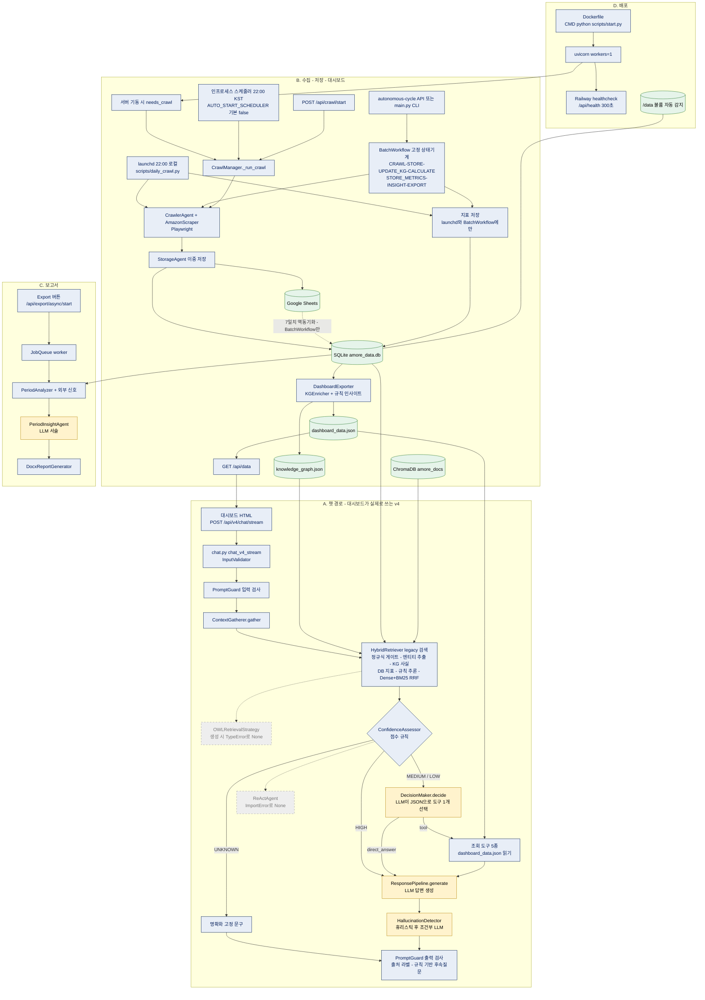

# AMORE RAG-KG Hybrid Agent — 기술 근거 정리 (지원서·포트폴리오·면접용)

> 작성일: 2026-09-17 · 분석 기준: 브랜치 `refactor/data-integrity-2026-08-31`, HEAD `eb0812a` (2026-09-17T13:23:48+09:00)
> 방법: **읽기 전용 정적 분석**. `git log/show/diff`, 파일 판독, 로컬 데이터 파일의 읽기 전용 집계만 수행. 서버·테스트·크롤러·평가·LLM 호출은 실행하지 않음. checkout/reset/commit/push 없음.
> 이 문서 외에 저장소의 어떤 파일도 수정하지 않음.
>
> **2026-09-17 갱신 (공모전 이후 사후 보완).** 이 분석이 찾은 위험 지점 R1~R4를 같은 날 브랜치 `fix/wire-react-owl-2026-09`(`422ee6c`~`1c34d28`)에서 보완했다. 결정 경위는 `docs/plans/risk-remediation-decisions-2026-09-17.md`. 아래 본문은 원래 분석(HEAD `eb0812a`)을 보존하고, 바뀐 사실은 **[2026-09 사후]** 표시로 덧붙이거나 고쳤다. 이 표시가 붙은 수리·측정은 모두 공모전이 끝난 뒤의 작업이며, 공모전 당시의 동작을 말하지 않는다.

## 0. 읽는 법 — 증거 라벨

| 라벨 | 의미 |
|---|---|
| **[문서]** | README·docs·커밋 메시지에 적혀 있음. 코드로 확인되지 않았거나 확인 불가 |
| **[구현]** | 코드가 존재함. 실행 경로에 연결됐는지는 별개 |
| **[연결]** | 진입점(라우트·스케줄·스크립트)에서 호출 사슬이 정적으로 이어짐 |
| **[실행기록]** | 저장소에 남은 실행 산출물(`eval/baselines/*/report.json`, 로컬 DB·KG 파일)로 확인됨. 이번 분석에서 새로 실행한 것은 없음 |
| **[미연결]** | 코드는 있으나 어떤 진입점에서도 도달하지 않음 |

시각은 모두 author date, `+09:00`.

### 가장 먼저 알아야 할 5가지

1. **Git 이력은 개발의 처음부터가 아니다.** 최초 커밋 `aa131e6`(2026-01-01)에 이미 89개 파일 — KG, 추론기, 하이브리드 검색기, ChromaDB 검색, Sheets 저장, 대시보드 — 이 들어 있다. 로컬 DB의 가장 이른 스냅샷은 2025-12-16, 최초 커밋에 포함된 백업 파일명은 `ranking_data_backup_20251224_222714.xlsx`다. **KG·온톨로지를 "공부해서 적용한 과정"은 Git에 없다.** Git이 증명하는 것은 "2026-01-01에 이미 있었다"와 그 이후의 변경뿐이다.
2. **대시보드 챗이 실제로 타는 경로에 ReAct 에이전트와 OWL 검색 전략은 연결돼 있지 않다.** 둘 다 초기화 시 예외가 조용히 삼켜져 `None`이 된다(§3.3). "ReAct 에이전트가 동작한다"는 서술은 현재 코드로 뒷받침되지 않는다.
   **[2026-09 사후]** 연결을 수리했으나(`26cd8e6`, `0669b75`) 두 플래그 모두 **기본 OFF**다. 켜고 측정한 1회에서 ReAct는 한 번도 발동하지 않았고 OWL 검색은 필터 결함으로 문서를 거의 가져오지 못했다(§3.3). "연결됨, 기본 비활성, 효과 미입증"이 현재 상태다.
3. **Google Sheets → SQLite는 교체가 아니라 병행(이중 쓰기) + Sheets→SQLite 단방향 동기화다**(§4).
4. **KG·온톨로지가 답변 품질을 높였다는 실험 근거는 없다.** 유일한 유효 ablation은 KG가 필요 없는 30문항·1회 실행이며 차이는 노이즈 범위다(§5.4).
   **[2026-09 사후]** requires_kg=true 130문항·구성당 3회로 다시 쟀다. KG를 끄면 근거성이 0.717→0.541로 떨어졌지만 그중 일부는 채점 컨텍스트 효과다. 규칙 추론은 모든 실행에서 추론 0건이라 효과를 측정하지 못했다(§5.5).
5. **평가 수치는 대시보드가 쓰는 v4 경로가 아니라 v1 `HybridChatbotAgent`를 측정한 것이다**(`eval/cli.py:717-721`). 또한 채점 기준이 15회 바뀌어 v1.0↔v9.1을 그대로 전후 비교할 수 없다(§7).
   **[2026-09 사후]** 평가에 `--target v4`를 추가하고(`3c5af51`) v4 기준선 `brain-v4-1.0-2026-09-17`을 새로 만들었다. v1 기준선과는 비교하지 않는다(§7).

---

## 1. 비개발자용 프로젝트 개요

아마존 미국 사이트의 뷰티 베스트셀러 순위(5개 카테고리 × Top 100)를 매일 자동으로 수집해, 라네즈(LANEIGE)와 경쟁 브랜드의 위치를 숫자로 보여 주는 시스템이다.

- **수집**: 자동화된 브라우저(Playwright)가 순위·가격·평점을 긁어 온다.
- **저장**: 같은 데이터를 Google Sheets와 SQLite 데이터베이스 두 곳에 적는다.
- **지표**: 진열 점유율(SoS), 시장 집중도(HHI), 가격 경쟁력(CPI)을 계산한다.
- **대시보드**: 웹 화면에서 브랜드·카테고리·제품별 추이를 본다.
- **챗봇**: 질문을 받으면 ① 지표 해설 문서(벡터 검색), ② 브랜드–제품–카테고리–경쟁 관계를 담은 지식그래프, ③ DB의 최신 수치, ④ 규칙 기반 추론 결과를 모아 LLM(GPT-4.1-mini)에 넘겨 답을 만든다.
- **보고서**: 기간을 고르면 Word 분석 보고서를 만들어 준다.

"에이전트"라는 이름이 붙어 있지만, 현재 연결된 경로의 대부분은 **순서가 정해진 파이프라인**이고, LLM이 스스로 다음 행동을 고르는 지점은 한 곳뿐이다(§3.3).

---

## 2. 개발 이력과 시점

### 2.1 저장소 상태

| 항목 | 값 |
|---|---|
| 현재 브랜치 / HEAD | `refactor/data-integrity-2026-08-31` / `eb0812a` |
| main과의 관계 | main(`1bfcd19`, 2026-08-31T01:46:08) 대비 19커밋 앞섬, 뒤처진 커밋 0 |
| 추적 파일의 미커밋 변경 | 없음 (`git diff` 비어 있음) |
| 미추적 항목 17건 | `.agents/`, `.codex/`, `docs/portfolio/`, `docs/plans/refactoring-*.md` 2건, Finder 복제본 `* 2.py`·`* 2.md` 12건 (분석에서 제외) |
| 이력 범위 | HEAD 기준 343커밋, `3c5fed9` 2026-01-01T16:43:51 ~ `eb0812a` 2026-09-17T13:23:48. 전체 ref 기준 360커밋. shallow 아님 |
| 월별 커밋 | 2026-01: 172 · 02: 104 · 03: 5 · 08: 50 · 09: 12 |
| 공백 구간 | 01-07~01-17, 02-21~03-24, 03-28~08-23 |
| 태그 | `v-pre-refactor` → `fddb986`(2026-02-07T14:47:37). lightweight 태그라 생성 시각 불명. "제출본" 표기 없음 |
| 관련 브랜치 | `backup/pre-refactor-20260131` → `c40efb5`(2026-01-31T02:19:58). "제출본" 표기 없음 |

### 2.2 공모전 시점을 뒷받침하는 기록

**제출일·본선일·심사 결과를 적은 기록은 저장소에 없다 → 제출 시점 미확인.** 있는 것은 아래가 전부다.

| 근거 | 위치 | 내용 |
|---|---|---|
| 최초 README | `3c5fed9:README.md:2` (24분 뒤 `3f2d50d`에서 교체) | "아모레 퍼시픽 공모전에서 시행하는 ai agent 개발입니다" |
| 데모 언급 | `docs/CATEGORY_EXPANSION_GUIDE.md:142,147` (`7d20e32`, 2026-01-18) | "For AMOREPACIFIC competition demo" / "Post-competition" |
| 법적 고지 | `docs/DATA_COLLECTION_POLICY.md:83` (`7d20e32`) | "as part of an academic competition" |
| 멘토링 반영 계획 | `.sisyphus/drafts/implementation-plan-v1.md:11-24` (`0671bae`, 2026-01-23 커밋) | "아모레퍼시픽 멘토링 피드백을 반영", "핵심 요구사항 (회의록 기반)" 7항목 |
| 일정 압박 | 같은 파일 `:243`, `.sisyphus/plans/implementation-complete-report.md:142` | "공모전 일정 압박", "장기 (공모전 후)" |

확정되는 사실은 하나다: **2026-01-18~19 시점에 공모전은 진행 중(데모 이전)이었다.** 그 이후 어느 커밋까지가 공모전용인지는 저장소로 판별할 수 없으므로 기능을 "당시/이후"로 분류하지 않는다. 최초 커밋은 개발 시작일도 제출본도 아니다(§0-1).

### 2.3 주요 변경 연표

| 날짜·시각(+09:00) | 커밋 | 변경 내용 | 근거 파일 | 확인할 수 있는 사실 |
|---|---|---|---|---|
| 2026-01-01 16:45 | `aa131e6` | 최초 코드 일괄 커밋(89파일) | `ontology/knowledge_graph.py`, `ontology/reasoner.py`, `ontology/business_rules.py`, `rag/hybrid_retriever.py`, `rag/retriever.py`, `agents/storage_agent.py`, `migrate_excel_to_sheets.py`, `requirements.txt` | KG·규칙 추론·하이브리드 검색·ChromaDB(`all-MiniLM-L6-v2`, 실패 시 키워드 폴백)·Sheets 단독 저장이 이 시점에 이미 존재. Excel→Sheets 이관 스크립트 포함 |
| 01-03 00:27~02:04 | `bd71f46`…`d5a9f7b` (8커밋) | Railway 첫 배포. CMD의 `$PORT` 처리 5회 변경 끝에 `start.py`로 이관, `railway.toml`의 `startCommand` 삭제, healthcheck 100→300초 | `Dockerfile`, `railway.toml`, `start.py` | 97분간의 시행착오 과정. 각 단계의 실패 로그는 없음 |
| 01-03 00:47 / 01:42 | `8725009` / `db1a085` | 이미지 축소용 경량 requirements 도입 → 55분 뒤 되돌림 | `requirements-railway.txt`, `Dockerfile` | 시도와 철회 |
| 01-03 04:13 | `5dae007` | 일일 자동 크롤 추가: `"hour": 21  # UTC 21:00 = 한국시간 06:00` | `core/brain.py` | 서버가 UTC라는 가정에 의존 |
| 01-03 06:47 | `5452572` | 대시보드 `API_BASE` localhost 하드코딩 제거, `data/dashboard_data.json`을 git에 포함 | `.gitignore`, 대시보드 HTML | 배포 환경에서 데이터가 안 보이는 문제의 첫 우회(§6-B) |
| 01-03 07:19 | `cb14bc2` | `KST = timezone(timedelta(hours=9))` 도입, 스케줄·"오늘" 판정을 KST로 | `core/brain.py`, `core/crawl_manager.py` | 시간대 변환 수정(§6-A) |
| 01-03 07:37 / 07:55 / 08:15 | `6470c88` / `8957be6` / `1037400` | Sheets 자격증명을 환경변수로, 제품별 upsert를 배치로(429 대응), ID `.strip()`, 저장 실패를 성공으로 로깅하던 것 교정 | `tools/sheets_writer.py`, `agents/storage_agent.py` | 컨테이너에 자격증명 파일이 없는 문제와 쿼터 문제에 대한 수정 구현 |
| 01-03 08:32~08:44 | `838be10`, `4cb10f0`, `fd2386b` | `snapshot_date`·`generated_at`·화면 표시를 KST로 | `amazon_scraper.py`, `crawler_agent.py`, `dashboard_exporter.py`, 대시보드 HTML | 데이터 날짜 라벨 수정(§6-A) |
| 01-18 20:01 | `7d20e32` | AI 출처 표시, 할인 추적, LICENSE·데이터 수집 정책 | `docs/DATA_COLLECTION_POLICY.md` 등 | 커밋 메시지에 "competition compliance". 어떤 규정에 대응했는지는 기록 없음 |
| 01-19 09:11 | `f6c4614` | "AMORE mentoring feedback" 반영: 카테고리 계층, 할인 분석, 경쟁사 체계 | `config/category_hierarchy.json` 등 | 멘토링 요구의 2차 기록은 §8.1 |
| 01-19 18:58 | `853ab31` | 카테고리에 Amazon node ID·level 부여 | `config/category_hierarchy.json`, 크롤러 | Lip Care(3761351)와 Lip Makeup(11059031) 구분의 근거 |
| 01-20 06:07 | `c40d886` | `dashboard_data.json`·`scheduler_state.json` git 추적 해제 | `.gitignore` | 메시지는 "날짜 불일치"지만 실체는 배포 영속성 문제(§6-B) |
| 01-20 23:47 | `04f8c3c` | `sqlite_storage.py` 최초 도입(deals용, raw_data 스키마 포함) | `src/tools/sqlite_storage.py` | SQLite 등장 |
| 01-21 14:51 | `4d81bd8` | Excel export가 "빈 SQLite" 대신 JSON 사용 | `dashboard_api.py` | 이 시점에 SQLite `raw_data` 기록자가 없었음 |
| 01-21 18:28 | `35fcc91` | `StorageAgent`에 `enable_sqlite=True` — Sheets→SQLite 순 이중 저장 | `src/agents/storage_agent.py` | 이중 쓰기 시작 |
| 01-23 01:46 | `0671bae` | Clean Architecture 디렉터리, `config/brands.json`, exporter를 SQLite 우선으로 | 다수 | 읽기 정본이 SQLite로 |
| 01-23 16:30 | `b2a4d2e` | 임베딩을 로컬 SentenceTransformer → OpenAI `text-embedding-3-small`. 저장은 ChromaDB 유지 | `src/rag/retriever.py` | 메시지의 "OpenAI vector search"는 호스티드 벡터스토어가 아님 |
| 01-23 18:12 | `06f5ea4` | OWL 파일, owlready2 추론기, EntityLinker, ConfidenceFusion, CrossEncoder | `src/ontology/cosmetics_ontology.owl` 등 | OWL 계층 도입. 메시지의 "2/10→8/10"은 자가 평가 |
| 01-25 00:29 | `f1335c5` | `AUTO_START_SCHEDULER` 기본값 true→false, `await start_crawl()`→`create_task` | `dashboard_api.py` | §6 부록 참조 — 메시지의 원인 진단이 당시 코드와 불일치 |
| 01-25 16:52 | `8dfc12c` | 크롤 후 Sheets→SQLite 7일치 자동 동기화 + 정합성 검사기 | `src/core/batch_workflow.py`, `src/tools/data_integrity_checker.py` | §6 부록 참조 |
| 01-25 18:30 / 18:46 | `55112c6` / `10e525c` | Railway↔로컬 SQLite 동기화 API·스크립트, "3중 저장소" 문서화 | `scripts/sync_from_railway.py`, CLAUDE.md | |
| 01-25 22:44 | `a0a8741` | 크롤 시각 KST 06:00 → 22:00 | `src/core/scheduler.py` | 버그 수정이 아닌 수집 시각 설계 변경 |
| 01-28 17:21 | `a965437` | `src/core/react_agent.py` 추가 | `src/core/react_agent.py`, `src/core/brain.py` | 같은 커밋에서 `brain.py`가 존재하지 않는 `..agents.react_agent`를 import — 처음부터 미연결 |
| 01-31 02:19 | `c40efb5` | "박종대 연구위원 개선안 반영" | `period_insight_agent.py`, `export_handlers.py` | 저장소 안에서 이 이름은 증권사 애널리스트(정보 출처)로만 등장. 피드백 원문 없음 |
| 02-09 23:40 | `3e078ae` | 평가 시스템(eval/) 추가 | `eval/` | 평가 하니스 등장 |
| 02-15~02-19 | `812bfbd`…`4ed631b` | 리팩터링 Phase 1~6, 스프린트 1~10(골든셋 160문항 `78669d9`, BM25/RRF·OWL 제약 `ac332bb`, SPARQL·IRCoT `92da983`) | 다수 | 상당수가 [구현]이지만 [미연결](§3.4) |
| 02-18 01:29 ~ 02-19 14:36 | `162e147`, `00c0fcc`, `7ab97c4`, `56fa042` | Railway 볼륨 `/data` 경로 정합 | `crawl_manager.py`, `brain.py`, `dependencies.py`, `config_manager.py` | §6-B |
| 02-19 02:19~02:59 | `b528e92`→`95d2e0c`→`60fae41` | gosu/entrypoint 시도 후 40분 만에 철회 | `Dockerfile` | 컨테이너는 현재 root 실행 |
| 03-25 02:09 | `f54b511` | launchd 기반 로컬 Mac 일일 크롤 | `scripts/daily_crawl.py`, `scripts/launchd/*.plist` | 정기 수집 주체가 로컬로 |
| 08-24 10:52 / 10:57 | `1cd4307` / `c244cea` | KG 일일 동기화 복구, 서버 상주 KG를 읽기 전용으로 | `dashboard_exporter.py`, `brain.py` 등 | §6-C |
| 08-30 01:54 ~ 19:32 | `1f1d148`…`a46ce76` | 평가 baseline v1.0~v8.1, ablation, reranker 비활성(`7d8725b`), KG 엔리치먼트 배선(`ef271b3`), 코퍼스 정리(`b411bb9`) | `eval/baselines/`, `docs/experiments/` | §7 |
| 08-31 | `c046fa5`, `9dc02aa` 등 | 하드코딩 KPI 제거, HHI 단일 구현, 가드레일 실동작 | 다수 | 데이터 무결성 리팩터링 |
| 09-06 ~ 09-12 | `1ac4e2e`, `5f8d29b`, `11698b7`, `41d75d7`, `96673d1`, `3fce8e8` | 종합 점수 공식 변경, 골드 3층 분리, 분산 3회 측정, 수치 정확도 거짓양성 교정, 결측 지표가 규칙을 발화시키던 결함 수정, DB 수치를 컨텍스트에 | `eval/`, `src/ontology/reasoner.py`, `src/rag/metric_facts.py` | §5, §7 |
| 09-17 13:23 | `eb0812a` | launchd 경로에 지표 저장 스텝 추가 | `scripts/daily_crawl.py` | 09-01 이후 지표 테이블 공백의 수정 구현 |

---

## 3. 실제 아키텍처 (HEAD `eb0812a` 기준)

### 3.1 다이어그램

범례: 파랑 = 순서가 고정된 코드, 노랑 = LLM이 판단·생성, 회색 점선 = 구현됐으나 미연결, 초록 = 저장소.

### 3.2 구성요소와 연결 상태

**챗 경로**

| 구성요소 | 역할 | 파일:함수(줄) | 상태 |
|---|---|---|---|
| 대시보드 챗 UI | SSE로 `/api/v4/chat/stream` 호출 | `dashboard/amore_unified_dashboard_v4.html:9424` | [연결] |
| v4 스트림 라우트 | 입력 검증 후 `brain.process_query_stream` | `src/api/routes/chat.py:chat_v4_stream(219-278)` | [연결] |
| `/api/v4/chat`(비스트림) | `brain.process_query` | `chat.py:chat_v4(146-216)` | [연결] — 대시보드는 호출 안 함, CLI `main.py --chat`만 |
| `/api/chat`(v1) | `ChatWorkflow` → `HybridChatbotAgent.chat` | `chat.py:chat(39-135)`, `src/infrastructure/container.py:460-478` | [연결] — 대시보드는 호출 안 함. **평가 하니스가 측정하는 경로**. `4247f16`에서 복구 |
| PromptGuard | 입·출력 정규식 가드 | `src/core/prompt_guard.py:check_input(145)`, `check_output(207)` | [연결] |
| ContextGatherer | `retriever.retrieve_unified` 호출 | `src/core/context_gatherer.py:gather(89-192)`, `:121-122` | [연결] |
| HybridRetriever(legacy) | 게이트→의도→엔티티→KG 사실→DB 지표→규칙 추론→RRF 검색→병합 | `src/rag/hybrid_retriever.py:retrieve(432-642)` | [연결] — 실질 주경로 |
| OWLRetrievalStrategy | OWL 추론 + CrossEncoder + Fusion | `src/rag/retrieval_strategy.py:238-457` | **[미연결]** §3.3 (**[2026-09 사후]** 연결, 플래그 기본 OFF) |
| ConfidenceAssessor | 컨텍스트 점수 → HIGH/MEDIUM/LOW/UNKNOWN | `src/core/confidence.py:35-37, 88-103` | [연결] |
| DecisionMaker | LLM이 도구 1개 또는 direct_answer 선택 | `src/core/decision_maker.py:decide(108-183)` | [연결] — 유일한 LLM 선택 지점 |
| 조회 도구 5종 | `dashboard_data.json` 읽기 | `src/core/brain.py:903-907` | [연결] |
| ReActAgent | Thought-Action 루프, max 5회 | `src/core/react_agent.py:run(227-297)` | **[미연결]** §3.3 (**[2026-09 사후]** 연결, 플래그 기본 OFF) |
| ResponsePipeline | 최종 답변 LLM 호출. KG 사실·추론 각 상위 3건만 프롬프트에 포함 | `src/core/response_pipeline.py:generate(121-228)`, `:326-335` | [연결] |
| HallucinationDetector | 신뢰도에 0.6을 곱하는 데만 사용. 답변은 바꾸지 않음 | `src/core/hallucination_detector.py:check(55-124)` | [연결] |
| LLM 모델 | `DEFAULT_MODEL = "gpt-4.1-mini"`, `litellm.acompletion` | `src/shared/constants.py:55` | [연결] |

**수집·배포**

| 구성요소 | 역할 | 파일:함수(줄) | 상태 |
|---|---|---|---|
| 기동 시 크롤 | KST 오늘 데이터 없으면 백그라운드 크롤 | `src/api/dashboard_api.py:lifespan(103-119)` | [연결] |
| 인프로세스 스케줄러 | 22:00 크롤, 08:00 브리프, 23:00 정합성 | `src/core/scheduler.py:111-155`, `:125` | [조건부] `AUTO_START_SCHEDULER` 기본 `"false"`(`dashboard_api.py:81`). 23:00 정합성 검사는 상시 핸들러에 분기가 없어 no-op(`brain.py:1668-1697`) |
| launchd 일일 크롤 | 로컬 Mac 22:00. 크롤→SQLite→Sheets→지표→export | `scripts/launchd/com.amore.daily-crawl.plist:23-26`, `scripts/daily_crawl.py:run_pipeline(77-222)` | [연결] — 로컬 전용. 지표 스텝은 `eb0812a`에서 추가 |
| CrawlManager | 크롤→JSON→StorageAgent→Exporter | `src/core/crawl_manager.py:_run_crawl(294-448)` | [연결] — **지표 저장·KG 갱신·인사이트 스텝 없음** |
| BatchWorkflow | 7단계 고정 상태기계. `_think`는 LLM이 아니라 if/elif | `src/application/workflows/batch_workflow.py:WorkflowStep(127-137)` | [연결] — 비주경로(CLI와 `POST /api/v4/brain/autonomous-cycle`만) |
| StorageAgent | Sheets 먼저, SQLite 다음 | `src/agents/storage_agent.py:105-137` | [연결] |
| DashboardExporter | SQLite 30일치로 JSON 생성, KG 영속 기록 | `src/tools/exporters/dashboard_exporter.py:139-196`, `:1521-1542` | [연결] |
| 보고서 | 비동기 Job → PeriodAnalyzer → PeriodInsightAgent(LLM) → DOCX | `src/tools/exporters/export_handlers.py:126-347` | [연결] |
| 배포 | `python:3.11-slim` + Playwright, `scripts/start.py`가 `PORT` 읽어 uvicorn 기동, healthcheck 300초 | `Dockerfile`, `railway.toml`, `src/api/routes/health.py:63-67` | [연결] — health는 정적 응답만, DB·LLM 점검 없음 |
| CI | Ruff, 단위테스트+coverage, Bandit | `.github/workflows/test.yml` | [연결] — main/develop 대상. `pyproject.toml:59`의 `fail_under = 0`이라 "60% 목표"는 강제되지 않음 |

크롤 파이프라인이 **세 갈래(CrawlManager / BatchWorkflow / launchd)** 이고 스텝 구성이 서로 다르다는 점이 `eb0812a`(지표 테이블 공백)의 구조적 배경이다.

### 3.3 고정 워크플로 vs LLM이 선택하는 Agent 동작

**LLM이 행동을 고르는 곳은 현재 연결된 경로에서 `DecisionMaker.decide` 한 곳뿐이다.**

- 방식: 프롬프트에 도구 설명을 나열하고 `{"tool", "tool_params"}` JSON을 요구한 뒤 `find("{")`/`rfind("}")`로 잘라 `json.loads`(`decision_maker.py:185-205`). **네이티브 function-calling은 쓰지 않는다**(`tools=`, `tool_choice` 사용처 0건).
- 선택지: 조회 도구 5종 + `direct_answer`. 반복·관찰 재투입 없음(단발).
- 발동 조건: 신뢰도 MEDIUM/LOW일 때만. HIGH면 코드가 `direct_answer`를 직접 만들고(`src/core/query_graph.py:509-520`), UNKNOWN이면 고정 문구.
- 파싱 실패 시 `direct_answer`로 폴백.

**ReAct는 [구현]이지만 [미연결]이다.**

- `src/core/brain.py:380`이 `from ..agents.react_agent import get_react_agent`를 import하는데 `src/agents/react_agent.py`는 **존재한 적이 없다**(`git log --all -- src/agents/react_agent.py` 0건). 실제 파일은 `src/core/react_agent.py`이며 `a965437`(2026-01-28)에서 추가된 날부터 경로가 어긋나 있었다.
- 예외는 `brain.py:385-387`에서 `logger.debug`로만 남고 `_react_agent = None`. `get_react_agent`/`ReActAgent(`의 다른 호출처는 src에 없다.
- 설령 연결해도 ① `ALLOWED_ACTIONS`의 `query_data`·`query_knowledge_graph`·`calculate_metrics`는 실행기가 등록돼 있지 않고(`brain.py:903-907`에 5종만), ② `react_agent.py:244-245`가 `step.observation`으로 최종 답을 만드는데 `_parse_step`(`:400-415`)이 그 값을 채우지 않는다. 단위 테스트(`tests/unit/core/test_react_agent.py`)는 있으나 서비스 경로와 무관하다.

**OWL 검색 전략도 [미연결]이다.** `brain.py:326-330`과 `container.py:170-174`가 `docs_path="./docs"`를 넘기지만 `OWLRetrievalStrategy.__init__`(`retrieval_strategy.py:251-260`)에는 그 파라미터가 없다 → TypeError → `brain.py:332`에서 `logger.info`로 삼켜짐. **[2026-09 사후 정정]** 원래 "`9c32aba`(2026-02-08)에서 유입"으로 적었으나 부정확했다. `9c32aba` 당시 `docs_path`는 `get_true_hybrid_retriever`의 유효 인자였고, `f049cb8`(2026-02-15) 리팩터가 이 호출을 `OWLRetrievalStrategy`로 바꾸면서 인자만 남겨 그때부터 깨졌다. 단, `OWLReasoner` 인스턴스 자체는 예외 전에 만들어져 KG→OWL 브랜드 동기화(`brain.py:782-794`)에는 쓰인다.

**LLM이 "생성만" 하는 고정 스텝**: `ResponsePipeline`, `HallucinationDetector._llm_check`, `PeriodInsightAgent`, `HybridInsightAgent`, `MorningBriefGenerator`, v1의 `QueryRewriter`.

**LLM이 전혀 없는 부분**: 검색 파이프라인 전체(게이트·의도 분류·엔티티 추출·KG 조회·규칙 추론·RRF), 신뢰도 라우팅, 세 크롤 파이프라인, 지표 계산, exporter, 스케줄러, 알림.

**[2026-09 사후] 연결 수리와 측정 결과** (공모전 이후 작업)

| 항목 | 수리 전 (HEAD `eb0812a`) | 수리 후 |
|---|---|---|
| ReAct import | 존재하지 않는 `..agents.react_agent` → 항상 `None`, `logger.debug` | `src/core/react_agent.py`를 import, 플래그 `agents.use_react_agent`(기본 OFF) — `26cd8e6` |
| OWL 전략 생성 | `docs_path` TypeError → 항상 `None`, `logger.info`/`pass` | `create_owl_strategy` 팩토리, 플래그 `retriever.use_owl_strategy` 기본값 true→**false**, HybridRetriever와 문서 검색기 공유 — `26cd8e6`, `0669b75` |
| ReAct 도구 | `query_data`·`query_knowledge_graph`·`calculate_metrics` 실행기 없음 | 읽기 전용 실행기 3종(`src/core/react_tools.py`), DecisionMaker 도구 목록과 분리 |
| 최종 답 | 채워지지 않는 `observation`에서 읽어 항상 빈 문자열 | `action_input.answer`에서 읽고, 반복 한도 도달 시 관찰 기반 답 1회 요청 |
| 실패 가시성 | debug/info 로그 | warning 로그 + `/api/v4/brain/status`의 `components` |

증명 테스트: `tests/unit/core/test_react_owl_wiring.py`(LLM·문서 색인만 가짜, 배선·KG는 실제 객체. 수리 전 코드에서는 ReAct 경로 테스트가 DecisionMaker로 새어 실패), `test_react_loop_fixes.py`, `test_react_tools.py`.

측정(`docs/experiments/kg_ablation_2026-09.md` §6, v4 경로, 130문항 1회, 두 플래그 ON): **ReAct 발동 0건.** 평가 문항이 v4 기준선 172/172, KG 실험 130/130 모두 신뢰도 HIGH로 분류돼 **DecisionMaker와 ReAct 분기에 한 번도 도달하지 않았다.** 즉 위 "LLM이 행동을 고르는 유일한 지점"도 이 평가 데이터에서는 실행되지 않았다(대시보드 실제 트래픽의 분포는 미측정). OWL 검색은 `_matches_filters`가 엔티티 링커의 `$or` 필터를 처리하지 못해 엔티티가 연결된 124/130문항에서 문서를 0건 가져왔다(수리하지 않음, FUTURE_WORK 9.8). 판정(결정 D1): 두 플래그 **OFF 유지**.

**[2026-09-18 사후] 트랙 4 — OWL 검색 전략 자체를 삭제, 도구 레지스트리 통합** (`docs/experiments/evidence_pipeline_2026-09.md` 4단계). 위 표의 "OWL 전략 생성"·"ReAct 도구 3종"은 이후 다시 바뀌었다:

- **OWL 검색 전략 삭제**: `OWLRetrievalStrategy`·`create_owl_strategy`·플래그 `retriever.use_owl_strategy`가 코드에서 사라졌다(결정 S4-1, 커밋 `eb5dff2`·`f604c13`·`167ec1b`·`b59beab`). 위에서 "연결, 플래그 기본 OFF"라고 적은 전략 자체가 더는 존재하지 않는다 — "플래그를 켜면 동작하는 미완성 기능"에서 "설계상 없는 기능"으로 바뀌었다. OWL은 이제 카테고리 계층 어휘로만 쓰이고(`src/ontology/owl_reasoner.py`), 온톨로지 신호(엔티티·카테고리 일치)는 legacy 검색 경로(Dense+BM25 RRF) 결과 위의 재정렬 가산점으로 흡수했다(트랙 4-B). **[2026-09 사후 정정, 트랙 O6]** "OWL은 카테고리 계층 어휘로만 쓰인다"는 사실과 달랐다. 카테고리 계층은 `config/category_hierarchy.json`을 `kg_updater.load_category_hierarchy()`가 읽어 KG에 넣으며 OWL과 무관하다. `owl_reasoner.py`·`ontology_knowledge_graph.py`·`cosmetics_ontology.owl`은 서비스 호출처 0건으로 삭제됐다(호출처 확인표 `docs/experiments/ontology_activation_O6_section.md`). 같은 커밋에서 호출처가 없던 `unified_reasoner.py`·`llm_orchestrator.py`(603줄)·`query_processor.py`·SPARQL 계층(`kg_query.py`)도 함께 삭제했다(소스 −2,237줄, 테스트 포함 −5,741줄).
- **ReAct 전용 도구 3종 폐지**: `query_data`·`query_knowledge_graph`·`calculate_metrics`(읽기 전용 실행기 3종)는 DecisionMaker와 완전히 같은 단일 레지스트리 5종(`resolve_entity`·`kg_neighbors`·`get_metrics`·`apply_rules`·`search_docs`, 모두 증거 카드 반환)으로 교체됐다(트랙 4-A, 커밋 `bdfb187`~`6140254`, `src/core/tool_registry.py`). DecisionMaker 자신도 `{"tool", "tool_params"}` JSON을 텍스트에서 잘라내던 방식에서 OpenAI 네이티브 function calling(`tools=`, `tool_choice="auto"`)으로 바뀌었다. 대시보드 JSON 전용 도구, ReAct 전용 3종, 소비처가 사라진 `src/core/tools.py`는 모두 삭제됐다.
- 게이트: 전체 테스트 `6140254`에서 5,901 passed, 엔티티 연결 질의 문서 0건 문항이 0으로 해소(위 문단의 124/130 결함 해소). 통합 시험지 231문항 1회 측정에서 종합 점수 0.676→0.682(차이 없음), L2 개념 Recall 0.634→0.669(+0.035, 차이 있음). 단일 실행이라 판정 임계는 이전 3회 측정 폭을 빌려 썼다(한계는 실험 문서에 명시).

위 문단 "평가 문항이 …모두 신뢰도 HIGH로 분류돼 …분기에 한 번도 도달하지 않았다"는 트랙 5-B(신뢰도 점수를 증거 적합도 기반으로 교체 — 엔티티 충족도 0.60 + 카드 종류 충족 0.40, 검색 점수 분포는 ±0.05 동점 가르기로만 반영, 임계값 HIGH 0.95/MEDIUM 0.61/LOW 0.60, `src/core/confidence.py`, 커밋 `bb0627f`·`450e9d1`·`5fb6030`)가 정면으로 겨냥한 문제다. 이전 점수(개수 가중합)는 검색이 항상 비슷한 양을 담아 와 233문항 중 230문항이 HIGH였다. **다만 이 재작업 이후의 172문항(또는 233문항) 재평가는 `docs/experiments/evidence_pipeline_2026-09.md`에 아직 없다** — HIGH 편중이 실제로 줄어 DecisionMaker·ReAct 분기가 평가에서 실행되는지는 **미측정**이다.

**[2026-09-18 사후] 위 "미측정"의 후속 측정** (`docs/experiments/evidence_pipeline_2026-09.md` 5·6단계, 결정 S6-1~S6-5). 공모전 이후 작업이다.

- 5단계(233문항 1회, `ba714eb`): 경로 분포 direct 185 / decide 31 / clarify 16 — DecisionMaker 분기가 평가에서 실제로 실행된다. 다만 "HIGH 구간 실패율 < LOW 구간 실패율" 조건은 충족하지 못했다(0.75 vs 0.74). 원인은 임계값이 아니라 증거 선별(질의마다 카드 ~70장이 비슷하게 실려 233문항 중 184문항이 충족도 만점)이다.
- 6단계(④다단계+②관계 54문항, 구성별 3회): ReAct를 켜도(`agents.use_react_agent`) 신뢰도 HIGH가 먼저 걸러 ReAct는 5문항에서만 돌았다. HIGH 관문을 우회한 측정(30문항 ReAct)에서는 토큰 F1이 오르지만(+0.034) ReAct가 답한 문항의 관련성이 떨어지고(−0.046) 비용 +46%·지연 +13%였다. 원인: 토큰 예산 12,000 소진 후 강제 답변 73/90, 카드 인용 누락 33/90, 탐색 미완. **판정: ReAct 기본 OFF 유지.** 답변 수치 검증기는 annotate(기록만) 유지 — enforce 대상 수치의 87~88%가 카드에 있거나 카드 값에서 계산된 값이었다.
- 따라서 2026-09-18 기준 정확한 표현은 여전히 "LLM 도구 선택 1단계가 포함된 RAG 파이프라인. ReAct 루프는 연결·측정됐으나 켜기 조건을 충족하지 못해 기본 비활성"이다.

> 정확한 표현: "LLM 라우팅 1단계가 포함된 고정 RAG 파이프라인". "자율 에이전트"·"ReAct 자기성찰"은 구현 코드는 있으나 서비스 경로에서 동작하지 않는다. `chat.py:154-158, 226`의 docstring("모든 판단을 LLM이 수행", "ReAct + OWL 지원")은 코드와 다르다. **[2026-09 사후]** 실제 분기와 플래그 기본값에 맞게 고쳤다(`26cd8e6`). 2026-09 이후 표현: "LLM 라우팅 1단계가 포함된 고정 RAG 파이프라인. ReAct 루프는 연결돼 있으나 기본 비활성." **[2026-09-18 사후 추가 정정]** "OWL 검색 전략은 연결돼 있으나 기본 비활성"이라는 표현은 더 이상 맞지 않는다 — 그 전략 자체가 삭제됐다. ~~"OWL은 카테고리 계층 어휘로만 쓰고, 검색 전략이 아니다"로 쓸 것.~~ **[2026-09 사후 정정, 트랙 O6]** "OWL은 카테고리 계층 어휘로만 쓰인다"는 사실과 달랐다. 카테고리 계층은 `config/category_hierarchy.json`을 `kg_updater.load_category_hierarchy()`가 읽어 KG에 넣으며 OWL과 무관하다. `owl_reasoner.py`·`ontology_knowledge_graph.py`·`cosmetics_ontology.owl`은 서비스 호출처 0건으로 삭제됐다(호출처 확인표 `docs/experiments/ontology_activation_O6_section.md`). 쓸 표현: "온톨로지 원본은 JSON(`config/ontology/`) + Python 폐포 로더(`src/ontology/ontology.py`)이고, OWL은 개발 전용 Pellet 교차 검증(`scripts/check_ontology_owl.py`)에만 쓴다. 질의 경로 사용은 플래그 `ontology.use_class_reasoning` 뒤에 있으며 기본 OFF(효과는 O7 측정 전)."

### 3.4 사용하지 않는 코드·계획 단계 기능

| 대상 | 판정 | 근거 |
|---|---|---|
| `src/core/react_agent.py` (ReAct, IRCoT, multi-hop) | [미연결] → **[2026-09 사후] [연결, 플래그 기본 OFF]** → **[2026-09-18 사후]** DecisionMaker와 같은 `tool_registry` 5종 공유(트랙 4-A) | §3.3 |
| `OWLRetrievalStrategy`, `Container.get_unified_retriever` | [미연결] → **[2026-09 사후] 전략은 [연결, 플래그 기본 OFF], 검색 필터 결함 있음** → **[2026-09-18 사후] 전략 자체 삭제**(`OWLRetrievalStrategy`·`create_owl_strategy`·플래그 `retriever.use_owl_strategy`, 트랙 4-C, 커밋 `eb5dff2` 등). OWL은 카테고리 계층 어휘로만 남음(**[2026-09 사후 정정]** 사실과 달랐음 — OWL 모듈 자체가 O6에서 삭제, 카테고리 계층은 `config/category_hierarchy.json`). `Container.get_unified_retriever` 호출처 0건 문제는 미해결로 남음(§9.9.1) | §3.3 |
| `src/ontology/unified_reasoner.py` | [미연결] → **[2026-09-18 사후] 파일 삭제**(트랙 4-C, 호출처 0건 죽은 코드) | 인스턴스화 0건이었다. 플래그 `use_unified_reasoner`는 이름과 달리 실제로는 `OntologyReasoner` on/off로만 쓰인다(`hybrid_retriever.py:577`) — 삭제된 파일과 동명이 아니라 혼동 주의 |
| SPARQL (`src/ontology/kg_query.py:499, 771`) | [미연결] → **[2026-09-18 사후] 삭제**(트랙 4-C, SPARQL 계층 전체 제거) | 호출 0건이었다 |
| CrossEncoder reranker, RelevanceGrader | [구현, 플래그 OFF] | `config/feature_flags.json:4` `"use_reranker": false` |
| `src/core/llm_orchestrator.py`(603줄), `src/core/query_processor.py` | [미연결] → **[2026-09-18 사후] 둘 다 삭제**(트랙 4-C) | import 0건이었다. `query_processor.py`가 하던 질의 분기는 `query_graph.py`의 `QueryGraph`가 맡는다 |
| `InsightWorkflow`, `AlertWorkflow`, `CategoryService`, `SentimentService` | [미연결] | container getter뿐 |
| `src/adapters/*`, `src/application/orchestrators` | 빈 패키지 | `__init__.py`만 |
| `src/core/batch_workflow.py`, `true_hybrid_insight_agent.py`, `crawl_workflow.py` | [문서]에만 → **[2026-09 사후] CLAUDE.md 구조도에서 제거**(`1c34d28`) | 파일 없음 |
| 도구 `crawl_amazon`, `calculate_metrics`, `query_data`, `query_knowledge_graph`, `query_deals*` | 정의만 | 실행기 미등록. **[2026-09 사후]** `calculate_metrics`·`query_data`·`query_knowledge_graph`는 ReAct 전용 읽기 전용 실행기를 구현(DecisionMaker에는 미등록). `crawl_amazon`·`query_deals*`는 그대로. **[2026-09-18 사후]** 이 이름들 자체가 사라졌다 — DecisionMaker·ReAct가 공유하는 단일 레지스트리 5종(`resolve_entity`·`kg_neighbors`·`get_metrics`·`apply_rules`·`search_docs`, 모두 증거 카드 반환)으로 교체(트랙 4-A). `crawl_amazon`·`query_deals*`는 이 레지스트리 밖으로 변화 없음 |
| RelationType 36종 중 26종 | 정의만 | 로컬 KG에 저장된 predicate는 10종 |
| `product_metrics`, `deals*` 테이블 | 스키마만 | 로컬 DB 0행 |
| `scripts/docker-entrypoint.sh` | 잔존 파일 | `60fae41`에서 참조 제거 |

선례: `4247f16`(죽어 있던 v1 챗 복구), `a2a1c64`(미연결 소셜 수집기 4종 1,605줄 삭제), `d930085`(no-op이던 ablation 플래그 배선), `ef271b3`(호출처 없던 KGEnricher 배선). **"구현했다"와 "동작한다"의 간격을 저장소 스스로 여러 번 기록하고 있다.**

**문서와 코드가 다른 대표 항목** (**[2026-09 사후]** 아래 항목은 `1c34d28`에서 CLAUDE.md·README·AGENTS.md·`dashboard_api.py` docstring을 코드 기준으로 교정했고, PORTFOLIO_FACTS.md는 기준 커밋 `2b04aa1` 동결 고지를 달고 본문을 보존했다): CLAUDE.md §2의 "sentence-transformers (all-MiniLM-L6-v2)" → 실제 임베딩은 OpenAI `text-embedding-3-small`(`src/rag/retriever.py:457`). README:188의 "CrossEncoder 리랭킹" → 플래그 OFF. `dashboard_api.py:52` docstring의 "default: true" → 코드는 false(`:81`). PORTFOLIO_FACTS.md(기준 커밋 `2b04aa1`, 2026-08-30)는 160문항·KG 1,028트리플·가드레일 no-op·소셜 수집기 "통합 예정" 등이 현재와 다르다(현재 172문항, 3,500트리플, `9dc02aa`에서 가드레일 구현, `a2a1c64`에서 수집기 삭제).

---

## 4. 저장소별 역할과 데이터 흐름

### 4.1 요약

| 저장소 | 저장 내용 | 쓰기 | 읽기 | 도입 |
|---|---|---|---|---|
| **Google Sheets** | 시트 5개(RawData, Products, Brand/Product/MarketMetrics) — `src/tools/storage/sheets_writer.py:35` | `StorageAgent.execute` → `append_rank_records`(`storage_agent.py:106`), `upsert_products_batch`(`:175`) | `get_rank_history`(`sheets_writer.py:417`), `batch_workflow._sync_sheets_to_sqlite`(`:406-447`) | `aa131e6` 2026-01-01 (그 전엔 Excel, `migrate_excel_to_sheets.py`) |
| **SQLite** `data/amore_data.db` | 9개 테이블. `raw_data`는 `UNIQUE(snapshot_date, category_id, rank)` — `sqlite_storage.py:41-210` | `storage_agent.py:115-137`, `scripts/daily_crawl.py:160-167`, 지표는 `sqlite_storage.py:571, 629` | exporter primary(`dashboard_exporter.py:131-134`), `src/rag/metric_facts.py:81`, data·analytics·export 라우트 | 파일 `04f8c3c` 01-20, 순위 이중 저장 `35fcc91` 01-21 |
| **ChromaDB** `data/chroma/` | 컬렉션 `amore_docs`. MD 14종(지표 가이드 4, 시장·전략 7, IR 분기보고서 3) — `retriever.py:132-430` | `_index_documents` 증분 색인(`retriever.py:897-946`), OpenAI 임베딩 | `_vector_search`(`:1102`) + BM25(`:1207`) + RRF(`:1280-1312`) | `aa131e6`부터 |
| **KG JSON** `data/knowledge_graph.json` | 트리플(subject, predicate, object, properties, confidence, source, 시각) | 실질 기록자는 daily crawl의 `dashboard_exporter.py:1521-1542`(`KGEnricher`) + `kg_updater.py:584`(브랜드 시드) | `hybrid_retriever.py:_query_knowledge_graph(812)`, `kg_query.py` | `aa131e6`부터 |
| **OWL** `src/ontology/cosmetics_ontology.owl` | Class 23, ObjectProperty 13, DatatypeProperty 20, SWRL 블록. 정적 파일 | — | `OWLRetrievalStrategy`([미연결]) | `06f5ea4` 01-23. **[2026-09 사후]** 파일 삭제(81행 `<` 미이스케이프로 어떤 도구로도 로드 불가였음, 트랙 O6). 대체 원본: `config/ontology/schema.json`·`brands.json` |
| **dashboard_data.json** | 대시보드·챗 도구용 파생 캐시 | `export_dashboard_data`(`dashboard_exporter.py:139-194`) | `GET /api/data`, 조회 도구 5종 | `aa131e6`부터, SQLite 우선은 `0671bae` |
| OpenAI 호스티드 벡터스토어 | **없음** | — | — | `b2a4d2e`는 임베딩 모델만 교체 |

### 4.2 관계 판정 — 교체 / 병행 / 동기화

| 쌍 | 판정 | 근거 |
|---|---|---|
| Excel → Sheets | **교체** (Git 이력 이전) | `aa131e6:migrate_excel_to_sheets.py` |
| Sheets ↔ SQLite | **병행(이중 쓰기) + Sheets→SQLite 단방향 동기화** | 01-01~01-20 Sheets 단독 → `04f8c3c` SQLite 파일 등장 → `35fcc91` 이중 저장 → `8dfc12c` 7일치 역동기화·검사기. 현재도 `storage_agent.py:105-119`에서 둘 다 기록 |
| SQLite → dashboard_data.json | **파생 캐시** | `dashboard_exporter.py:131-134` |
| Chroma · KG · SQLite(지표) | **병행** — 검색 시점에 컨텍스트로 합류 | `hybrid_retriever.py:516-560` |
| 로컬 임베딩 → OpenAI 임베딩 | **교체** | `b2a4d2e` |
| Railway SQLite ↔ 로컬 SQLite | **수동 동기화** | `55112c6`(내려받기), `5042401`(올리기) |

**"SQLite = Source of Truth, Sheets = 백업"(CLAUDE.md)의 검증 결과: 읽기는 맞고 쓰기는 부분적으로만 맞다.**
- 읽기: exporter·`metric_facts`·API가 모두 SQLite를 정본으로 읽는다.
- 쓰기(서버 경로): `StorageAgent`는 Sheets를 **먼저** 쓰고 SQLite를 나중에 쓴다. SQLite 실패 시 "sync_sheets_to_sqlite.py로 수동 동기화하라"는 경고(`storage_agent.py:140-141`). 자동 동기화 방향도 Sheets→SQLite. 즉 복구 관점에서는 Sheets가 상류다.
- 쓰기(launchd 경로): SQLite 먼저·실패 시 error, Sheets는 non-fatal(`daily_crawl.py:160-176`). 이 경로만 문서 서술과 일치한다.
- 지표는 SQLite 전용이다.

### 4.3 로컬 데이터 파일 관찰값 (2026-09-17, 읽기 전용)

| 항목 | 값 |
|---|---|
| `raw_data` | 42,592행, 2025-12-16 ~ 2026-09-17, **서로 다른 스냅샷 104일**(약 9개월 중 — 일일 연속 아님) |
| 기타 테이블 | products 1,273 · brand_metrics 13,838 · market_metrics 509 · competitor_products 52 · product_metrics/deals* 0 |
| 고유 값 | ASIN 1,415, 브랜드 276 |
| ChromaDB `amore_docs` | 358청크 |
| KG | 3,500트리플, 노드 844. predicate: belongsToCategory 879, siblingBrand 874, hasProduct 632, competesWith 630, hasPosition 359, 소유·세그먼트·원산지 각 31, acquiredIn 2 |
| KG 출처 | `kg_enricher`(크롤 파생) 2,479 · `config/brands.json`(수작업 시드) 1,000 · system 21 |

관찰된 데이터 품질 문제: KG에 주어 `unknown`·`fresh`(브랜드 오추출) 트리플 잔존, CR 문자가 붙은 `data/chroma\r` 디렉터리, 미참조 컬렉션 `amore_docs_all_MiniLM_L6_v2`(82청크).

**[2026-09 사후] `data/chroma` 오염 사고 (2026-09-17 17:01).** OWL 전략을 연결한 뒤 켜고 평가하던 중, `OWLRetrievalStrategy` 생성자 기본값이 시맨틱 청킹 DocumentRetriever를 따로 만들어 `amore_docs`에 청크 787개를 추가 색인했다(358 → 1,145). 증분 색인이라 기존 358청크는 남아 있고 추가분 ID는 식별돼 있다(`eval_output/risk-remediation-2026-09-17/chroma_added_ids.json`). 동시에 돌던 평가 2회는 검색 실패가 삼켜져 무효 처리했다. 재발 방지는 `0669b75`. **이 문서 갱신 시점(2026-09-17)에 로컬 `data/chroma`의 `amore_docs`는 1,145청크 그대로이며 복구하지 않았다** — 복구는 소유자 결정 사항이다. 위 "358청크"는 사고 전 관찰값이다.

---

## 5. RAG·KG·온톨로지의 실제 작동 방식

### 5.1 지식그래프 — 노드와 관계

- 노드는 타입 없는 문자열(브랜드명, ASIN, category_id). 엔티티 모델은 `src/domain/entities/`.
- 관계 정의: `src/domain/entities/relations.py:15-155`에 36종(구조·소유·순위·경쟁·지표 의미·시간·상태·감성). **실제 저장되는 것은 10종.**
- 트리플 생성 경로 3가지 — 모두 규칙 기반, LLM 없음:
  - **크롤 파생(영속, 주 기록자)**: `KGEnricher.enrich_from_crawl`(`src/ontology/kg_enricher.py:80`) — HAS_PRODUCT·BELONGS_TO_CATEGORY(`:128-170`), COMPETES_WITH(`:173-203`, "같은 카테고리 Top 100에 제품 2개 이상인 브랜드끼리 전 쌍"), PRICE_POSITION(`:206`), hasSoS·rankedIn·hasHHI(`:289-349`). 저장 시 predicate가 축약돼 원래 의미는 `properties.original_predicate`에만 남는다(`:387-396`).
  - **런타임 메모리**: `KGUpdaterMixin.load_from_crawl_data`(`src/ontology/kg_updater.py:47-122`).
  - **수작업 시드**: `load_brand_ownership("config/brands.json")`(`kg_updater.py:584-765`) — 그룹 소유, 세그먼트, 원산지, 인수 연도, siblingBrand.
- `competesWith`는 도메인 지식으로 정한 경쟁 관계가 아니라 **Top 100 공출현을 기계적으로 옮긴 것**이다.
- 영속 KG가 크롤 데이터로 채워지기 시작한 것은 `ef271b3`(2026-08-30)부터다. 그 전까지 `KGEnricher`는 호출처가 없었고(`e8d5081`에서 파일만 추가), 영속 KG는 사실상 brands.json 시드(1,028트리플)였다.

### 5.2 온톨로지 — 개념과 규칙

- 개념: `MarketPosition` 9종(`relations.py:208` — dominant, dominant_in_fragmented, challenger, …), `InsightType` 26종, 카테고리 계층(`config/category_hierarchy.json`, Amazon node ID), OWL 클래스 23개.
- 규칙 엔진: `OntologyReasoner.infer`(`src/ontology/reasoner.py:294`), 규칙 37개(`src/ontology/rules/__init__.py:27-48` — market 6, alert 3, growth 7, price 7, sentiment 8, ir 6). 최초 커밋의 `ontology/business_rules.py`에도 규칙이 이미 있었다.
- 예(`src/ontology/rules/market_rules.py`):

| 규칙(줄) | 조건 | 결론 |
|---|---|---|
| market_dominance_fragmented (13-34) | SoS ≥ 0.15 AND HHI < 0.15 | dominant_in_fragmented, 신뢰도 0.9 |
| market_dominance_concentrated (40-60) | SoS ≥ 0.20 AND HHI ≥ 0.25 | dominant |
| challenger_position (66-91) | HHI ≥ 0.25 AND 0.05 ≤ SoS < 0.15 | challenger, 0.85 |
| fragmented_market_competition (97-122) | HHI < 0.15 AND 경쟁 브랜드 ≥ 5 (KG 조회) | "분산 시장, n개 경쟁 브랜드" |

### 5.3 검색·답변에 개입하는 위치

`HybridRetriever.retrieve`(`src/rag/hybrid_retriever.py:432-640`) 안에서 순서대로:

1. `should_retrieve` — 정규식 게이트(`:401`)
2. 의도 분류 + 의도별 검색 설정(`:478-485`)
3. **엔티티 링킹** — `EntityLinker.extract_entities`(`src/rag/entity_linker.py:542`). 사전 = CATEGORY_MAP(`:177`) + `config/entities.json`. spaCy는 끔(`hybrid_retriever.py:248`)
4. **KG 사실 조회** — `_query_knowledge_graph`(`:812-1090`): 브랜드 정보, 제품, 경쟁사, 지표 엣지(상한 12), 카테고리 브랜드 등. 플래그 `use_ontology_kg`(**[2026-09 사후]** 이름을 `kg.enabled`로 바로잡음, 옛 이름은 별칭)
5. DB 지표 — `metric_facts_provider.collect`(`:526-531`, `3fce8e8`에서 추가)
6. **규칙 추론** — `_build_inference_context`(`:1091`) → `reasoner.infer`(`:537-541`)
7. 추론 결과·엔티티로 쿼리 확장(`:547`) → ChromaDB dense + BM25 → RRF
8. 병합(`_weighted_merge`, `_combine_contexts :1640`)

프롬프트 반영은 경로에 따라 다르다.
- **v4(대시보드)**: `ResponsePipeline`이 KG 추론 상위 3건, KG 사실 상위 3건만 넣는다(`response_pipeline.py:326-335`).
- **v1(평가 대상)**: `ContextBuilder.build`(`src/rag/context_builder.py:331-400`)가 "분석 결과(Ontology Reasoning)"·"크롤 DB 지표"·"관련 정보(Knowledge Graph)"·RAG 섹션을 조립. KG 섹션은 사실 상위 5개, 4개 유형만 — 제품은 **개수만**, 경쟁사는 **이름 3개만**(`:649-688`). 지표 엣지·경쟁 네트워크·계층은 조회만 되고 렌더링되지 않는다. `docs/experiments/eval_cycle10_2026-09-12.md:89-93`도 "L3 엣지 recall은 오르는데 답변은 그 엣지를 모른다"고 기록했다.

**규칙 추론의 입력이 비어 있다**(코드 기반 추정, 미실행): `_build_inference_context`는 `summary`·`brand_metrics`·`market_metrics` 키를 읽는데, 운영 경로가 넘기는 `dashboard_data.json`의 최상위 키(metadata, home, brand, categories, products, charts …)와 겹치지 않는다. `96673d1` 이후 결측이면 규칙이 발화하지 않으므로 SoS·HHI 기반 포지션 규칙은 챗 경로에서 거의 발화하지 않을 것으로 보인다. 그 수정 전에는 결측을 0으로 읽어 **"HHI: 0.000"을 지어내고 있었다.**

### 5.4 예시 질문 — 코드 기반 설명 (미실행)

골든셋 `eval/data/golden/laneige_golden_v2.jsonl`의 **lg109 "Aquaphor와 LANEIGE의 Lip Care 경쟁 관계는?"** (gold 엣지 `laneige -competesWith-> aquaphor`).

1. 게이트: 브랜드·카테고리 키워드가 있어 검색 진행.
2. 엔티티 링킹: brands=[laneige, aquaphor], categories=[lip_care]. "Lip Care"가 `lip_care`로 정규화되어 `lip_makeup`과 구분된다(`entity_linker.py:178`) — **개념 정규화가 실제로 일하는 지점.**
3. KG 조회: `get_competitors("laneige")`. 로컬 KG의 laneige 발 competesWith 29건 중 lip_care 상대에 aquaphor 포함. 지표 엣지로 `laneige -hasSoS-> lip_care {3.0%, 2026-08-30}`.
4. DB 지표: SQLite에서 lip_care의 HHI, SoS 상위 브랜드, 두 브랜드의 점유율·가격을 **날짜와 함께** 가져온다. gold 답의 구체 수치는 KG가 아니라 이 경로로만 맞출 수 있다(KG의 hasSoS 값은 낡음).
5. 규칙 추론: competitor_count=29는 채워지나 sos·hhi는 결측 → 시장 포지션 규칙 미발화.
6. 확장 질의로 Chroma+BM25 검색 → 전략·지표 해석 문서 청크.
7. 컨텍스트 조립: KG 섹션에는 "laneige 경쟁사: (저장 순서상 앞 3개)"만 들어가므로 **aquaphor 엣지는 조회되지만 프롬프트에는 안 나올 수 있다.**
8. gpt-4.1-mini가 답변 생성.

### 5.5 "부족한 데이터를 보완했다"는 표현의 검토

| 해석 | 판정 | 근거 |
|---|---|---|
| (a) 데이터 **양**을 늘렸다 | **거의 아님** | 트리플의 71%(2,479)는 같은 크롤 데이터의 재표현. 시드 1,000건 중 874건은 siblingBrand 전 쌍 조합. 크롤에 없던 외부 지식은 브랜드 소유·세그먼트·원산지·인수 약 126건과 카테고리 계층뿐 |
| (b) 기존 데이터의 **관계**를 활용했다 | **그렇다, 다만 얕다** | hasProduct·belongsToCategory·competesWith·hasSoS. 영속 배선은 2026-08-30(`ef271b3`)에야. 프롬프트에는 제품 수·경쟁사 이름 3개 수준만 전달 |
| (c) **개념을 정규화**했다 | **그렇다 — 가장 실질적** | 엔티티 링킹 사전, Amazon node ID 계층(`853ab31`)으로 Lip Care/Lip Makeup 구분, `brand_resolver`의 ASIN→브랜드. 한계: LANEIGE/laneige 이중 표기를 조회 시 변형 4종으로 우회(`hybrid_retriever.py:884-893`), 오추출 잔존 |
| (d) 규칙으로 **새 진술을 도출**했다 | **코드는 있으나 실효 제한적** | §5.3. 한때는 없는 데이터를 지어내는 방향으로 작동(`96673d1`에서 수정) |

**정확한 서술 제안**: "수집 데이터가 순위표 한 종류뿐이어서, 같은 데이터를 브랜드–제품–카테고리–경쟁 관계로 구조화하고 카테고리·브랜드 개념을 정규화해 질의에 쓰려 했다." → "데이터를 보완했다"·"데이터 부족을 해결했다"는 쓰지 말 것.

**비교 실험**: 유효한 것은 `docs/experiments/ablation_2026-08-30.md` 하나다. 30문항(`subset_nokg.jsonl`, **전부 `requires_kg=false`**), 6구성, 구성당 1회. 종합 점수 기준 KG 제거 −0.015, 온톨로지 제거 −0.006 — 문서 스스로 ±0.01을 노이즈로 적었다. KG를 끄면 groundedness는 오히려 +0.006, 지연은 12.6→8.8초. 게다가 이 측정은 트레이스 오염 수정(`5b64536`) 이전, KG 엔리치먼트(`ef271b3`) 이전이다. 2026-04-03의 이전 ablation은 no-kg·no-ontology 플래그가 no-op이었으므로 인용 불가(PORTFOLIO_FACTS.md:255 "수치 인용 금지"). **→ KG·온톨로지로 성능이 향상됐다고 주장할 근거는 없다.** 이 실험의 실제 결론은 reranker 비활성화(+0.020, groundedness 0.237→0.414, 지연 12.6→5.2초, `7d8725b`)였다.

**[2026-09 사후] 재실험** (`docs/experiments/kg_ablation_2026-09.md`, 2026-09-17, v4 경로, requires_kg=true 130문항, full / KG off / 규칙 추론 off 각 3회):

| 지표 | full | KG off | 판정 |
|---|---|---|---|
| L5 근거성 | 0.717 [0.688, 0.733] | 0.541 [0.521, 0.564] | 차이 있음 — 단 일부는 채점 컨텍스트 효과 |
| L5 관련성 | 0.840 | 0.862 | 차이 없음 |
| L5 토큰 F1 | 0.128 | 0.122 | 차이 없음 |
| 종합 / 통과 수 | 0.639 / 10 | 0.610 / 2 | 차이 있음 — L3 게이트·엣지 지표의 기계적 하락이 섞임 |

- 답변과 judge 컨텍스트를 바꿔 끼운 교차 채점(1회차 한 쌍): 컨텍스트를 고정해도 KG off 답변이 0.09~0.18 낮고, 답변을 고정해도 KG 사실을 뺀 컨텍스트가 0.03~0.13 낮게 준다. **"KG가 답변을 검색 근거에 더 붙게 만든다"는 정황은 있으나, 측정된 하락(−0.176)에는 채점 컨텍스트 효과가 섞여 있어 답변 자체의 효과만 떼어 말할 수 있는 크기는 교차 채점상 0.09~0.18이다.** 정답성 지표(토큰 F1·수치 정확도)의 개선 근거는 없다.
- **규칙 추론은 모든 구성·모든 실행에서 추론 0건** — 위 §5.3의 코드 기반 추정("규칙 추론의 입력이 비어 있다")이 실행으로 확인됐다. 규칙 추론의 효과는 측정 불가.
- 따라서 위 (d) "규칙으로 새 진술을 도출"은 **2026-09 평가 데이터에서 실효 0**이다.
- 한계: 구성당 3회, judge와 답변 모델이 같음, 모든 문항이 신뢰도 HIGH, KG off는 검색 시 KG 조회만 끔.

**[2026-09-18 사후]** 위 "규칙 추론 0건"은 이후 해소됐다(`docs/experiments/evidence_pipeline_2026-09.md` 3단계). 규칙이 증거 카드를 입력으로 받도록 재작업한 뒤(`src/ontology/rule_contracts.py`, 트랙 2-A) 233문항 시험지 3단계 측정(각 3회)에서 **규칙 발화 문항 비율 0.568, 규칙 정답 일치율 0.779**(규칙 off 0.469 대비 +0.310, 실행 범위 비겹침 — "차이 있음")로 나왔다. 오프라인(LLM 없이) 측정 규칙 일치율 25/32=0.781과도 일치한다. 다만:
- 같은 측정에서 **judge 종합 점수는 규칙 off가 0.022 더 높았다**(0.800 vs 0.822, 범위 비겹침) — 원인은 확인하지 않았다(가설: 규칙 발화가 만드는 추가 문장이 관련성·F1 채점에서 손해를 볼 수 있음).
- **부작용**: 규칙 추론 결과가 질의 확장(`_expand_query`)에 개입해 문서 검색이 바뀌었다(발화 문항 132개의 문서 겹침 0.472, 비발화 101개는 0.906) — 규칙과 무관한 유형(예: multihop)의 L2 개념 Recall도 −0.036 하락. 이 부작용은 트랙 4-B(색인 태그 가산점)가 대부분 되돌렸다(기준선 0.668 → 3단계 0.634 → 4단계 0.669).
- 즉 위 (d) "규칙으로 새 진술을 도출"의 실효는 **2026-09-18 이후 측정에서는 확인된다** — 다만 judge 종합 점수 기준으로는 방향이 갈린다는 점을 함께 적어야 한다. 위 단락(규칙 추론 0건)은 2026-09-17 측정 시점 기준 서술로 남겨 둔다.

---

## 6. 트러블슈팅 사례 (근거가 가장 강한 3건)

### 사례 A — UTC 서버에서 "오늘"이 하루 밀리던 문제 (2026-01-03)

"시차 문제"는 하나가 아니라 네 종류가 섞여 있다. 분류: **(a) 시간대 변환 / (b) 수집 일정 / (c) 데이터 날짜 라벨 / (d) 화면 표시·필터.**

- **증상** [문서] `fa78231` 시점 README "문제 2": KST 06:00 이후에도 크롤이 실행되지 않음. "문제 8": "한국 시간 1월 3일에 크롤링했는데 Google Sheets에 1월 2일로 저장됨 … 한국 08:18 KST = 서버 23:18 UTC". (두 섹션은 `df805cc`에서 README 재구성 때 삭제되어 Git 이력에만 있음.)
- **원인 근거** [diff] 수정 전 코드가 `date.today()`/naive `datetime.now()`를 썼고, `5dae007`의 주석 `# UTC 21:00 = 한국시간 06:00`이 서버가 UTC임을 전제한다.
- **수정 내용** [diff]
  - (a) `cb14bc2` 07:19 — `KST = timezone(timedelta(hours=9))` 도입, 스케줄 비교와 `crawl_manager`의 "오늘" 판정을 KST로.
  - (c) `838be10` 08:32 — `amazon_scraper.py`: `date.today().isoformat()` → `datetime.now(KST).date().isoformat()`, `crawler_agent.py`: `datetime.now().date()` → `datetime.now(KST).date()`.
  - (a) `4cb10f0` 08:39 — `dashboard_exporter.py`의 `generated_at`을 KST로.
  - (d) `fd2386b` 08:44 — 대시보드 `formatDateTime()`이 브라우저 시간대와 무관하게 KST로 표시.
  - 이후 (b) `a0a8741` 01-25 — 수집 시각 06:00→22:00 KST. **버그 수정이 아니라 설계 변경**(docstring의 이유: 미국 피크 판매가 BSR에 반영된 뒤 수집, 한국 업무 시작 전 준비). (d) `78c9330`·`ce5fc6c`·`3377feb`·`6434008` — 대시보드 날짜 범위 상태관리. `c40d886`은 메시지에 "날짜 불일치"가 있으나 실체는 사례 B.
- **확인 방법·결과**: **수정 구현 확인.** 85분 동안 스케줄 판정 → 데이터 라벨 → 메타 타임스탬프 → 화면 순으로 계층별 diff가 1:1로 확인된다. KST 테스트는 포맷·tz-aware 여부만 확인(`71eadf4`, 02-17에 추가). UTC 23:18 날짜 경계를 재현하는 회귀 테스트는 없다.
- **남은 불확실성 / 잔여 결함**
  - `snapshot_date`를 크롤 시작 시점에 고정하지 않고 호출마다 계산(`amazon_scraper.py:371, 481, 509`, `crawler_agent.py:123`). 22:00 시작 크롤이 자정을 넘기면 한 회차가 두 날짜로 갈린다 — `eb0812a` 메시지에 실제 사례("09-16 22:02 시작 → 09-17").
  - `src/core/brain.py:1387`의 naive `datetime.now()` 비교, 고정 오프셋(ZoneInfo 미사용), 브라우저 컨텍스트는 `America/New_York`인데 날짜 라벨은 KST.
  - 운영 환경에서 해결됐다는 로그는 없다.

### 사례 B — 배포 환경에서 데이터가 사라지거나 과거로 돌아가던 문제 (2026-01-03 ~ 02-19)

세 가지 메커니즘이 섞여 있다.

**B-1. 컨테이너 파일시스템과 "git에 넣기" 우회의 부작용**
- **증상** [msg] `5452572` "배포 환경 API 연결 및 데이터 문제", `c40d886` "대시보드 날짜 불일치".
- **원인 근거·수정** [diff] `5452572`: 대시보드 `API_BASE`가 `'http://localhost:8001'` 하드코딩 → `hostname === 'localhost' ? … : window.location.origin`. 같은 커밋에서 `.gitignore`에 `!data/dashboard_data.json`을 넣어 데이터 파일을 git에 포함. → `c40d886`(01-20)에서 그 예외를 제거하며 남긴 주석: "배포 시 오래된 데이터로 덮어쓰기되는 문제 방지". 삭제 직전 추적본의 `data_date`는 2026-01-02. 즉 **우회책(파일을 git에 포함)이 배포 때마다 런타임 산출물을 옛 파일로 덮는 부작용을 낳았고 17일 뒤 되돌렸다.**

**B-2. 자격증명 파일 부재와 Sheets 연동**
- **증상** [문서] README "문제 5"의 로그 인용: `No such file or directory: './config/google_credentials.json'` → `'NoneType' object has no attribute 'spreadsheets'`.
- **수정** [diff] `6470c88`: `sheets_writer.py`에 `GOOGLE_SHEETS_CREDENTIALS_JSON` 환경변수 우선 경로. `8957be6`: 제품별 upsert 루프 → `upsert_products_batch`(429 대응), ID `.strip()`. `1037400`: 반환값을 확인하지 않고 "Saved N records"를 찍던 **침묵 실패** 교정.
- 주의: README는 "전체 URL 입력"도 원인으로 적었으나 diff에는 `.strip()`만 있다(문서가 diff보다 많이 주장).

**B-3. 볼륨 `/data`와 상대경로 `./data` 불일치 (02-17 ~ 02-19)**
- **증상** [문서] `docs/analysis/dashboard-data-fix.md`: 대시보드가 "데이터 로딩중…"에서 멈춤.
- **원인 근거** [diff] `162e147`(02-18)이 **쓰는 쪽**(`crawl_manager`)만 `/data`로 옮겼고 **읽는 쪽** `src/api/dependencies.py`의 `./data/dashboard_data.json`은 그대로 → 파일 없음 → `/api/data` 404.
- **수정** [diff] `00c0fcc`(`brain.py`에 `/data` 자동 감지, `KnowledgeGraph()` 경로 자동화) → `7ab97c4`(`dependencies.py` 경로 해석, SQLite 폴백, `POST /api/data/refresh`) → `56fa042`(`AppConfig.data_path`, 404 대신 빈 구조 200). 같은 문제를 계층별로 반나절 3라운드.
- 같은 시기 `b528e92`→`95d2e0c`→`60fae41`: 볼륨 권한 때문에 gosu/entrypoint를 시도했다가 40분 만에 철회. 컨테이너는 현재 root 실행(`a87a861`의 비root 하드닝이 되돌려진 상태).
- **확인 방법·결과**: **수정 구현 확인.** 분석 문서의 "검증 방법"은 절차(curl, railway logs)만 있고 실행 결과는 없다.
- **남은 불확실성**: 경로 감지 방식이 두 가지(`RAILWAY_ENVIRONMENT` vs `/data` 존재)로 혼재, `batch_workflow.py:771,785`·`scheduler.py:63` 등에 `./data` 하드코딩 잔존. "healthcheck는 내부 IP라 `ALLOWED_HOSTS=*` 필요"는 [문서](`docs/troubleshooting/dashboard-fix-guide.md:68`)에만 있고 코드 기본값은 그대로.

### 사례 C — 지식그래프가 4개월간 갱신되지 않던 문제 (2026-08-24)

- **증상** [msg] `1cd4307`: `knowledge_graph.json`이 4월 3일 이후 갱신되지 않음.
- **원인 근거** [diff] 4가지가 겹쳐 있었다.
  1. `dashboard_exporter.py`가 `from ontology.…`로 import → `ImportError` → 조용히 `ONTOLOGY_AVAILABLE=False`. 이 구문은 **최초 커밋부터** 존재.
  2. `brain.py`가 존재하지 않는 `add_entity_metadata` 호출(`9c32aba`에서 유입) → `set_entity_metadata`.
  3. `kg_query.py:427`에 `_maybe_auto_save()` 누락.
  4. export 끝에 `save_if_dirty()` 플러시 없음.
  - **테스트가 버그를 박제하고 있었다**: `test_dashboard_exporter.py:109`의 `assert exporter.enable_ontology is False` → `is True`로 수정. `test_brain.py:1431`은 mock이 없는 메서드 호출을 통과시키고 있었다.
- **후속** `c244cea`: [msg] "크롤 저장 11초 후 서버가 구버전으로 덮어씀"(last-writer-wins). [diff] 서버 상주 인스턴스 6곳을 `KnowledgeGraph(auto_save=False)`로 바꾸고 기록자를 daily crawl의 exporter 하나로 단일화.
- **확인 방법·결과**: [msg] "테스트 145개 통과, `daily_crawl --dry-run`으로 1,000→1,022 트리플 확인", "테스트 1,193개 통과". 수치는 커밋 메시지 서술이며 원본 로그는 저장소에 없다. 간접 [실행기록]: 현재 로컬 KG가 3,500트리플, `kg_enricher` 출처 2,479건으로 실제로 갱신되고 있다.
- **남은 불확실성**: "11초" 관측 원본 없음. 서버와 크롤러가 같은 파일을 보는 구성(로컬 동시 실행)에서만 성립.
- **시점 주의**: 2026-08 작업이다. 공모전 기간의 경험으로 서술하면 안 된다.

### 부록 — 요청받아 조사했으나 대표 사례에서 뺀 것

| 커밋 | 조사 결과 | 제외 이유 |
|---|---|---|
| **`f1335c5`** healthcheck 타임아웃 (01-25 00:29) | [diff] `dashboard_api.py` 1파일: `AUTO_START_SCHEDULER` 기본값 `"true"`→`"false"`, `await crawl_manager.start_crawl()`→`asyncio.create_task(…)`. | **커밋 메시지의 원인 진단("await로 블로킹")이 당시 코드와 맞지 않는다.** 수정 직전 `src/core/crawl_manager.py:253-254`의 `start_crawl()`은 이미 `asyncio.create_task(self._run_crawl())` 후 즉시 `return True`였다. 실효가 있었을 변경은 기본값 false(startup에서 `brain.initialize()` — KG·추론기·검색기 초기화 — 를 제외)로 보이나, 지연 원인을 측정한 기록은 없다. 쓰려면 "당시 진단이 부정확했음을 사후에 코드로 확인했다"는 형태로만. |
| **`8dfc12c`** Sheets→SQLite 동기화 (01-25 16:52) | [diff] `_sync_sheets_to_sqlite()`(최근 7일, `INSERT OR REPLACE`, 키 `UNIQUE(snapshot_date, category_id, rank)`), `data_integrity_checker.py` 348줄(누락 1일↑ WARNING, 3일 초과 또는 gap 500 초과 CRITICAL). [문서] 당시 README: "Sheets에는 있으나 SQLite에 01-22~25 누락", 원인은 "볼륨 마운트 문제 **또는** 저장 오류". | 원인을 확정하지 못한 **증상 완화**(역동기화 + 검사기)다. 누락 날짜가 실제 복구됐다는 기록 없음. 업로드 경로(`45ebf2b`)는 `asin` 기준, 테이블 제약은 `rank` 기준으로 dedupe 키가 다르다. 참고: 01-21 "빈 SQLite"(`4d81bd8`)의 원인은 Railway가 아니라 그 시점에 `raw_data` 기록자가 아직 없었기 때문(`35fcc91`에서 같은 날 추가). |
| `bd71f46`…`d5a9f7b` PORT (01-03) | [diff] CMD가 exec form → shell form → `sh -c` → `python -c` → `start.py`로 5회 변경. 그동안 `railway.toml`의 `startCommand = "… --port $PORT"`는 그대로였고 마지막 커밋에서 삭제. | 과정은 선명하나 근본 원인(startCommand가 CMD를 덮어씀)은 diff가 아닌 플랫폼 지식에 의존. "처음 해 보는 배포의 시행착오" 소재로는 적합 — 단, 원인을 단정하지 말 것. |

---

## 7. 평가 결과 — 무엇을 말할 수 있고 없는가

**공통 조건**: 답변·judge 모두 gpt-4.1-mini, 답변 temperature 0.1, top-k 8, concurrency 4, 외부 신호 OFF. v9 이전은 모두 **1회 실행**. **평가 대상은 v1 `HybridChatbotAgent`**(`eval/cli.py:717-721`)로, 대시보드의 v4 Brain 경로가 아니다. baseline 파일에는 대상 커밋 SHA가 기록돼 있지 않아 아래 "커밋"은 baseline을 저장한 커밋이다.

| 평가 시각 | baseline ← 저장 커밋 | 문항 | 종합 / 통과 | 근거성 | 비교 시 주의 |
|---|---|---|---|---|---|
| 08-30 01:49 | v1.0 ← `1911d88` | 160 | 0.428 / 0 | 0.365 | 트레이스 오염 상태 |
| 08-30 02:59 | v2.0 ← `ae2ebed` | 160 | 0.442 / 2 | 0.392 | 청크 ID 재매핑 후 — v1.0과 L2 비교 불가 |
| 08-30 10:36 | v3.0 ← `ccff529` | 160 | 0.455 / 0 | 0.528 | 오염 상태 |
| 08-30 11:19 / 11:41 | v4.0 / v4.1 ← `01c5458` | 160 | 0.504 / 0.507 · 3 | 0.630 / 0.650 | **클린 측정의 시작** |
| 08-30 13:25 | v5.0 ← `499c26c` | 160 | 0.533 / 7 | 0.638 | 채점 크래시 7문항 복구 포함 |
| 08-30 14:23 | v6.0 ← `b9f5937` | 160 | 0.536 / 9 | 0.643 | |
| 08-30 16:57 | v7.1 ← `32238f0` | 160 | 0.562 / 17 (새 공식 0.620) | 0.678 | L2 골드 재설계 — 이전과 L2 단절. 코퍼스 2,242→358청크 |
| 08-30 19:29 | v8.1 ← `a46ce76` | **172** | 0.551 / 16 (새 공식 0.606) | 0.691 | 분모 변경. 기존 160 부분집합은 0.561 |
| 09-10 11:50 | v9.0 ← `11698b7` | 172 | 0.610 / 16 | 0.699 | 공식·골드 3층·게이트 동시 변경. 3회 실행의 중앙값 |
| 09-12 02:02 | v9.1 ← `41d75d7` | 172 | 0.610 / 15 | 0.699 | 수치 정확도 0.465 → **0.040**(거짓양성 교정, 무비용 재채점). 현행 기준선 |
| 사이클 10 | 미실행 | — | — | — | `docs/eval/remediation-progress.md` "승인 대기". `96673d1`·`3fce8e8`의 효과는 **미측정** |
| **[2026-09 사후]** 09-17 16:35 | brain-v4-1.0 ← `4344715` (대상 커밋 `3c5af51`) | 172 | 0.626 / 16 | 0.705 | **v4 경로**(`--target v4`). 위 v1 기준선들과 경로·프롬프트·온도·비용 집계 범위가 달라 **비교 불가**. 수치 정확도 0.029 |

**채점 기준·분모가 바뀐 지점(15곳)의 핵심**: `15773bf`(청크 ID 재매핑+의미 유사도 게이트), `5b64536`(동시 실행 트레이스 오염 수정 — v1.0~v3.0 전체가 하향 왜곡), `4c6d218`(채점 크래시 수정+L3 지표 전환), `56e3f82`(L2 골드 재설계), `b411bb9`(코퍼스 정리), `9f79ae1`(+12문항), `79e623e`(질의 확장 temperature 0.3→0), `1ac4e2e`(종합 점수 공식 변경), `5f8d29b`·`33390c0`(골드 3층 분리, 50건을 DB 기준 재작성), `41d75d7`(수치 채점기 교정), `3fce8e8`(judge 컨텍스트 정의 변경).

**직접 비교가 가능한 쌍**: v4.0~v6.0끼리 / v7.1↔v8.1은 160 부분집합(0.562↔0.561) / v8.1↔v9.0의 개념 recall 0.579→0.609 / v9.0↔v9.1(수치 정확도 제외).
**비교 불가**: "v1.0→v4.1 근거성 +78%"·`ccff529`의 "groundedness +35%" — 분자·분모 모두 오염 구간. 문서(cycle3)가 스스로 "절대 비교는 v4.0 이후만 유효"라고 단서를 달았다.

**실행 간 분산**(`11698b7`, 동일 조건 3회, 총 $1.13): 종합 최대−최소 0.003, 검색 계열 0.001~0.002, 근거성 0.023, **통과 수 4건(20/18/16)**. 3회 모두 같은 답이 나온 문항은 7/172. → 통과 수 5건 미만, 근거성 0.03 미만의 차이는 해석 불가.

**[2026-09 사후] v4 경로 측정에서 새로 드러난 것** (`docs/experiments/eval_v4_baseline_2026-09-17.md`, `kg_ablation_2026-09.md`):
- 대상 경로: `eval/brain_adapter.py`가 `UnifiedBrain.process_query`(QueryGraph)를 호출한다. 대시보드의 `process_query_stream`은 같은 분기 규칙을 따로 구현해 완전히 같은 코드는 아니다. 리포트에 `target`과 `git_commit`을 기록한다(이전 기준선에는 커밋이 없었다).
- 평가 문항 172/172가 신뢰도 HIGH로 분류돼 DecisionMaker·ReAct 분기가 실행되지 않았다.
- v4 답변 프롬프트에는 DB 수치 사실(`3fce8e8`)이 실리지 않는다(v1만 렌더링). snapshot 문항 통과 0건.
- **비용 수치 과소 집계**: `eval/cost_tracker.py`의 gpt-4.1-mini 단가가 공시가의 약 1/2.67이다. 위 표와 사이클 문서의 비용(예: 분산 3회 $1.13, 172문항 1회 $0.38)은 실제보다 낮다.
- 평가 중 검색 예외가 삼켜지면 하니스가 인프라 실패로 분류하지 못한다(2026-09-17 Chroma 오염 때 확인, §4.3). **[2026-09-18 사후]** 트랙 0-B(`024ad89`·`f083519`)에서 해소 — 핵심 검색 실패는 `context.metadata["retrieval_error"]`로 남아 하니스가 인프라 실패로 구분한다(`docs/dev/FUTURE_WORK.md` 9.8).

**[2026-09-18 사후] 증거 카드·규칙·도구 레지스트리 재작업 이후 v4 재측정** (`docs/experiments/evidence_pipeline_2026-09.md`, 공모전 이후 작업 — 위 baseline들과는 별도 계열):
- 규칙 재작업 직후(3단계, 233문항 각 3회, 규칙 on vs off): 규칙 정답 일치율 0.779 vs 0.469(+0.310, 차이 있음), 규칙 발화 문항 비율 0.568, **종합 점수는 규칙 on이 0.022 낮음**(0.800 vs 0.822, 차이 있음 — 방향이 엇갈림을 그대로 적는다), L5 수치 정확도 0.777 vs 0.790(차이 없음). 답변 수치 검증(annotate, 3회 합계 6,419개 수치): verified 31.9%, no_citation 61.5%(이 중 97.9%는 프롬프트의 다른 카드에는 있는 값), mismatch 6.1%, unknown_card 0.5%.
- 도구 레지스트리 통합 직후(4단계, 통합 시험지 231문항 1회, 판정은 3단계 3회의 폭을 빌림 — 단일 실행 비교의 한계 있음): 종합 점수 0.676→0.682(차이 없음), **L2 개념 Recall 0.634→0.669(+0.035, 차이 있음)** — 3단계에서 규칙 결과가 질의 확장에 개입해 생긴 검색 회귀(기준선 0.668 → 3단계 0.634)가 트랙 4-B(색인 태그 가산점)로 대부분 되돌아왔다. 규칙 정답 일치율 0.779→0.781(차이 없음). 엔티티 연결 질의 문서 0건 문항이 0으로 해소(§3.3의 124/130 결함).
- 비용 재계산(트랙 0-C, `f7d9bcd`)으로 `eval/cost_tracker.py`의 gpt-4.1-mini 단가를 공시가($0.40/$1.60)로 교정했다 — 아래 "비용 수치 과소 집계" 지적은 이 커밋 이후 실행된 위 두 측정에는 적용되지 않는다(단, 위 표의 기존 baseline 리포트 저장값 자체는 재계산하지 않았다).
- 트랙 5-B(신뢰도 점수 재작업)는 이 문서가 다루는 4단계 이후에 커밋됐다 — **위 172/172 HIGH 편중 재측정은 아직 없다**(§3.3).

**테스트·커버리지**(이번에 실행하지 않음): README(`5cd04a7`, 08-30) 5,242개 수집/5,235 통과/7 skip, 커버리지 72.19% — 로컬 `pytest --cov=src` 측정값이며 CI 산출물은 없다. "60% 목표"는 강제되지 않는다(`pyproject.toml:59`).

**저장소가 스스로 교정한 과장 수치**(`7e22ab7`): KG "50K+ 트리플"→실측 1,028, "API 비용 33%↓" 삭제(근거가 가상 예시), "코드 −27%" 삭제(비교 범위 상이). 이 교정 이력 자체가 "검증 습관"의 근거로 쓸 만하다 — 다만 §8.2의 저작 주의를 함께 볼 것.

---

## 8. 성과와 개인 기여의 근거

### 8.1 실제로 확인한 기업 요구 vs 내가 가정한 문제

| 구분 | 내용 | 출처 |
|---|---|---|
| **저장소가 아모레/멘토 요구로 귀속시킨 것** | ① 가격·할인 분석 ② 경쟁사 정보(Summer Fridays 등) ③ 카테고리 계층 ④ 할인↔순위 인과 ⑤ AI 출처 표시 ⑥ 시점 정보 ⑦ 글로벌 확장성(보류 — "시간 부족") | `.sisyphus/drafts/implementation-plan-v1.md:11-24` "핵심 요구사항 (회의록 기반)", `.sisyphus/plans/implementation-complete-report.md:80-90`, 커밋 `f6c4614`. 삭제된 `config/competitors.json`(→`d237ffe`)의 Summer Fridays 항목에 "멘토링에서 지정된 주요 경쟁사" 메모. `docs/guides/Data_Definition.md:141` "담당자가 직접 지정한 모니터링 대상" |
| **한계** | 회의록 원문·멘토 이름·일시는 저장소에 없다. 위는 모두 2차 요약이다 | — |
| **작성자 프레이밍으로만 존재** | As-Is/To-Be는 `docs/architecture/LLM_ORCHESTRATOR_DESIGN.md:37,66`에만 있고 **내부 아키텍처**에 관한 것(주최 측 업무 문제가 아님). `docs/PROJECT_PLAN.md`의 목표·인사이트 예시는 출처 귀속 없음. `7d20e32`의 "competition compliance"는 대응한 규정 인용 없음 | — |
| **찾지 못한 것** | 공모전 공식 명칭, 과제 설명서, 심사 기준, 제출물, 제출일, 본선 기록, 현업 pain point의 1차 자료 | — |

→ 지원서에서 "기업 요구를 반영했다"고 쓸 수 있는 범위는 위 7항목(멘토링 피드백)이다. 현업의 pain point와 As-Is/To-Be는 **본인 기억·외부 자료로만** 뒷받침할 수 있다.

### 8.2 Git이 말해 주는 것과 말해 주지 않는 것

| 항목 | 값 |
|---|---|
| author | "moveone" 325, alien2025 14(GitHub 웹 편집·PR 머지), Claude 4(2026-03-26~27) |
| `Co-Authored-By` 트레일러 | **293 / 343 커밋(85%)** — 모두 Claude 모델 |
| 트레일러 없는 커밋 | 50건(1월 36, 2월 10, 3월 4) |
| AI 도구 흔적 | `.claude/`, `.sisyphus/`, AGENTS.md 20개, `docs/plans/opus5-handoff-prompt*.md`, 커밋 메시지의 "multi-architect code review"(`a965437`), "Momus review"(`f6c4614`) |

- **입증되는 것**: 단일 소유자 계정이 거의 모든 커밋을 했고 다른 사람 기여자의 흔적이 없다. 커밋 시각과 순서. AI 공동 작성이 공개적으로 표기돼 있다.
- **입증되지 않는 것**: 코드 각 줄을 누가 썼는지, 기획·판단·검수의 몫, 공모전이 팀인지 개인인지, 트레일러 없는 50건이 AI 없이 작성됐는지. author 필드는 설정값일 뿐이다.
- 실험 문서의 1인칭 서술("내 설정 오류" 등)도 AI 세션이 쓴 문장일 수 있다.
- **면접 대비**: 저장소가 공개라면 면접관이 트레일러를 볼 수 있다. "AI 코딩 도구와 협업했고, 내 역할은 ○○였다"를 먼저 말하는 편이 안전하다. 본인 역할의 근거로는 기각한 변경과 이유를 남긴 기록들(cycle4 "LANEIGE 기본 주입 기각", cycle6 "IR 문항 보류", phase4 "되돌리지 않은 이유")이 그나마 가깝다.

### 8.3 본선 진출

본인이 제공한 사실이다. 저장소에 기록이 없고, 어떤 기술 요소 때문에 진출했는지 판단할 근거도 없다. **"KG·온톨로지 덕분에 본선에 진출했다"는 식의 인과 서술은 쓰지 말 것.**

---

## 9. 현재 확인된 기능 / 시점이 불확실한 기능

**현재 [연결]로 확인된 기능** (HEAD 기준, 동작 여부는 미실행)
- Amazon Top 100 × 5 카테고리 Playwright 크롤, KST 날짜 라벨
- Sheets + SQLite 이중 저장, SoS·HHI·CPI 계산(지표 저장은 launchd·BatchWorkflow 경로에만)
- 대시보드(`/dashboard`, `/api/data`), 날짜 범위 필터, DOCX·Excel 내보내기
- v4 챗: PromptGuard → 하이브리드 검색(Chroma dense + BM25 RRF, KG 사실, SQLite 지표, 규칙 추론) → 신뢰도 라우팅 → (MEDIUM/LOW 시) LLM 도구 선택 → 답변 생성 → 환각 점검·출처
- 평가 하니스(골든셋 172문항, L1~L5 지표, LLM judge, baseline 비교, 분산 측정) — 단 v1 경로 대상. **[2026-09 사후]** `--target v4`로 대시보드 Brain 경로도 측정 가능(§7)
- Railway 배포 구성, 로컬 launchd 일일 크롤, KG 7일 롤링 백업

**[실행기록]이 있는 것**: 로컬 DB 104일치 스냅샷, KG 3,500트리플, Chroma 358청크, baseline v1.0~v9.1 리포트.

**공모전 당시 존재 여부를 판별할 수 없는 기능**: 2026-01-19 이후의 모든 것. 확실한 것은 "01-01에 KG·추론기·하이브리드 검색·Chroma·Sheets 저장이 있었다"와 "01-18~19에 공모전이 진행 중이었다"뿐이다. OWL(01-23), SQLite 이중 저장(01-21), ReAct 파일(01-28), 평가 하니스(02-09), BM25/RRF(02-18)가 제출 전인지 후인지는 **본인 기억으로만** 가를 수 있다.

**확실히 공모전 이후로 보이는 것**(6개월 공백 뒤): KG 동기화 복구(08-24), ablation·평가 사이클(08-30~), 데이터 무결성 리팩터링(08-31~), 결측 지표 환각 수정(09-12).

---

## 10. 지원서에 쓸 수 있는 주장 / 추가 확인이 필요한 주장

### 10.1 근거가 있어 쓸 수 있는 주장

| 주장 | 근거 |
|---|---|
| Amazon 베스트셀러 5개 카테고리 Top 100을 수집해 SoS·HHI·CPI로 브랜드 경쟁력을 모니터링하는 시스템을 만들었다 | §3, 로컬 DB 104일·42,592행 |
| 문서 벡터 검색(ChromaDB)+BM25, 지식그래프 사실, DB 지표, 규칙 기반 추론을 하나의 컨텍스트로 합치는 하이브리드 검색을 구현했다 | `hybrid_retriever.py:432-640` |
| 순위 데이터를 브랜드–제품–카테고리–경쟁 관계의 트리플로 구조화하고, Amazon node ID 기반 카테고리 계층으로 Lip Care와 Lip Makeup을 구분했다 | §5.1, `853ab31` |
| 처음 해 보는 Railway 배포에서 포트 주입, 자격증명 주입, 볼륨 경로 문제를 단계적으로 수정했다 | §6-B, PORT 시리즈 8커밋 |
| UTC 서버에서 날짜가 하루 밀리는 문제를 스케줄 판정·데이터 라벨·타임스탬프·화면 표시 네 계층에서 수정했다 | §6-A |
| Google Sheets 단독 저장에서 SQLite 병행 저장으로 확장하고, 두 저장소 간 동기화·정합성 검사를 추가했다 | §4.2 — **"교체"가 아니라 "병행"으로 쓸 것** |
| 멘토링 피드백(카테고리 계층, 할인 분석, 지정 경쟁사 등)을 기능으로 반영했다 | §8.1 — 2차 기록 기준 |
| 172문항 골든셋과 다층 지표로 평가 체계를 만들었고, 실행 간 분산을 3회 측정해 "의미 있는 차이"의 기준을 세웠다 | §7, `11698b7` |
| ablation 결과로 reranker가 근거성과 지연을 악화시킴을 확인해 비활성화했다 | `7d8725b` — n=30·1회라는 단서 필수 |
| 추론 규칙이 결측 지표를 0으로 읽어 "HHI: 0.000"을 지어내던 결함을 찾아 고쳤다 / 테스트가 버그를 정상으로 박제하고 있던 것을 발견했다 | `96673d1`, `1cd4307` — **2026-08~09 작업임을 명시** |
| 자체 문서의 과장 수치를 실측으로 교정했다 | `7e22ab7` |
| **[2026-09 사후]** 사후 감사에서 "구현했지만 연결되지 않은" ReAct·OWL을 찾아 배선을 수리하고, 검증 전에는 켜지지 않게 플래그 기본 OFF로 두었다. 켜서 측정해 보니 효과가 없거나 결함이 드러나 OFF를 유지했다 | `26cd8e6`, `0669b75`, `docs/experiments/kg_ablation_2026-09.md` §6 — **공모전 이후 작업임을 명시** |
| **[2026-09 사후]** 평가가 서비스 경로와 다른 경로를 재고 있음을 발견해 서비스(v4) 경로 평가를 추가하고 기준선을 새로 세웠다 | `3c5af51`, `brain-v4-1.0-2026-09-17` |
| **[2026-09 사후]** KG 효과를 requires_kg 130문항·구성당 3회로 측정하고, 채점 컨텍스트 효과를 교차 채점으로 분리해 과대 해석을 막았다. 규칙 추론은 추론 0건이라 효과를 측정할 수 없음을 확인했다 | `docs/experiments/kg_ablation_2026-09.md` |
| **[2026-09-18 사후]** 규칙 추론이 증거를 지어내던 구조를 증거 카드 계약(입력·발화 근거 추적)으로 재작업했고, 233문항 측정으로 규칙이 실제로 발화(0.568)하고 정답 일치율을 0.469→0.779로 올리는 것을 확인했다(judge 종합 점수는 반대 방향이라는 사실도 함께 기록) | `docs/experiments/evidence_pipeline_2026-09.md` 3단계 |
| **[2026-09-18 사후]** ReAct·DecisionMaker가 쓰던 두 갈래 도구 정의(대시보드 JSON 5종 + ReAct 전용 3종)를 증거 카드를 반환하는 단일 레지스트리로 통합하고, DecisionMaker를 텍스트 JSON 파싱에서 네이티브 function calling으로 옮겼다. 전체 테스트 5,901 통과로 확인 | `src/core/tool_registry.py`, 트랙 4-A |
| **[2026-09-18 사후]** "구현했으나 검증 없이 기본 ON이던" OWL 검색 전략이 실제로는 검색 필터 결함으로 대부분의 질의에서 문서를 못 가져온다는 것을 확인한 뒤, 되살리는 대신 죽은 코드로 판단해 삭제하고 온톨로지 신호는 기존 경로의 재정렬 가산점으로 흡수했다(소스 −2,237줄) | `docs/plans/evidence-react-ontology-decisions-2026-09.md` S4-1, 트랙 4-C |

### 10.2 그대로 쓰면 위험한 주장

| 주장 | 문제 | 대안 |
|---|---|---|
| "ReAct 에이전트가 복잡한 질문을 자기성찰로 처리한다" | 서비스 경로 [미연결](§3.3). 처음부터 import 경로 오류. **[2026-09 사후]** 연결은 수리했으나 기본 OFF이고, 켜고 측정한 평가에서 발동 0건 | "ReAct 루프를 구현했으나 공모전 당시 서비스 경로에 연결되지 않았고, 사후 분석(2026-09)에서 찾아 연결했지만 효과가 확인되지 않아 기본 비활성으로 두었다" 또는 언급하지 않기 |
| "OWL 온톨로지 추론으로 검색한다" | OWL 전략 [미연결]. 실제 추론은 Python 규칙 엔진. **[2026-09 사후]** 연결 후 측정에서 필터 결함으로 124/130문항 문서 0건, 기본 OFF. **[2026-09-18 사후]** 전략 자체를 삭제했다 — 이제 OWL은 카테고리 계층 어휘로만 쓰이고 검색에 관여하지 않는다. **[2026-09 사후 정정, O6]** "카테고리 계층 어휘"도 사실과 달랐다 — OWL 모듈은 삭제됐고 카테고리 계층은 `config/category_hierarchy.json` | "규칙 기반 추론기(37개 규칙, 증거 카드 입력)를 검색 컨텍스트에 연결했다. 온톨로지 원본은 JSON + Python 폐포 로더이고, OWL은 개발용 Pellet 교차 검증에만 쓴다. 질의 경로의 온톨로지 클래스 추론은 플래그 뒤(기본 OFF, 효과 미측정)" ([2026-09 사후] 옛 권장 문구 "OWL 스키마는 카테고리 계층 검증에 쓴다"는 폐기) — 2026-09-17 측정 시점(규칙 추론 0건)과 2026-09-18 재작업 이후(발화 0.568, 정답 일치율 0.779, 단 judge 종합 점수는 규칙 off가 더 높음)를 구분해서 쓸 것(§5.5) |
| "자율 AI 에이전트", "LLM이 모든 판단을 수행" | LLM 선택 지점은 단발 도구 선택 1곳 | "LLM 라우팅이 포함된 RAG 파이프라인" |
| "KG·온톨로지로 부족한 데이터를 보완했다 / 성능을 높였다" | 데이터 양은 늘지 않았고 비교 실험상 효과는 노이즈 범위(§5.5). **[2026-09 사후]** 재실험에서 KG off 시 근거성 하락은 있으나 일부는 채점 효과, 정답성 지표는 차이 없음, 규칙 추론은 추론 0건. **[2026-09-18 사후]** 규칙 추론 0건은 그 뒤 해소됐다(발화 0.568, 정답 일치율 0.779) — 단 같은 측정에서 judge 종합 점수는 규칙 off가 더 높았다(§5.5) | "같은 데이터를 관계 구조로 재표현하고 개념을 정규화했다" + (쓴다면) "사후 실험에서 KG 사실이 답변을 검색 근거에 더 붙게 하는 정황을 확인했으나 정답성 개선은 확인되지 않았다. 규칙 추론은 이후 재작업에서 실제로 발화하고 규칙 판단 정답률을 올리는 것을 확인했지만, 전체 답변 품질(judge 종합 점수)에는 되레 불리했다" |
| "Google Sheets에서 SQLite로 교체했다" | 병행 + 동기화 | §4.2 |
| "근거성 +35% / +78% 개선" | 오염 구간 포함, 기준 변경(§7) | "클린 측정 이후 v4.0 0.630 → v9.1 0.699, 단 채점 정의가 중간에 바뀜" 정도로만 |
| "healthcheck 타임아웃을 비동기 전환으로 해결" | 메시지의 진단이 당시 코드와 불일치(§6 부록) | 기본값 변경 사실만, 또는 사용하지 않기 |
| "all-MiniLM 임베딩", "CrossEncoder 리랭킹", "커버리지 60% 게이트" | 각각 OpenAI 임베딩, 플래그 OFF, `fail_under=0` | 현재 코드 기준으로 |
| "매일 자동 수집·운영" | 9개월 중 스냅샷 104일. Railway 스케줄러는 기본 OFF, 정기 수집은 로컬 launchd | "일일 수집 파이프라인을 구축(수집일 104일)" |
| "KG·온톨로지를 새로 공부해 적용" | 사실일 수 있으나 Git에는 과정이 없다(최초 커밋에 이미 존재) | 본인 기억·학습 자료로 뒷받침 |
| "본선 진출은 ○○ 기술 덕분" | 근거 없음 | 사실만 병기 |

### 10.3 부수 발견 — 조치 권장

- `fa78231` 시점 README의 트러블슈팅 예시에 **실제 형식의 스프레드시트 ID 문자열**이 Git 이력에 남아 있다(현재 README에는 없음). 저장소가 공개라면 해당 시트의 공유 권한을 확인할 것. (이 문서에는 값을 옮기지 않았다.)
- 포트폴리오에 저장소 링크를 건다면 CLAUDE.md·README의 위 불일치 항목(§3.4 끝)을 먼저 고치는 편이 안전하다 — 면접관이 문서와 코드를 대조할 수 있다.

---

## 11. 본인에게 묻는 질문 (코드에서 찾을 수 없는 것)

1. **KG·온톨로지를 선택한 계기와 시점**: 2026-01-01 최초 커밋에 이미 KG·추론기가 있습니다. 그 전(2025-12 무렵) 무엇이 부족하다고 느꼈고, 어떤 대안(예: 문서를 더 모으기, SQL 질의)을 두고 KG를 택했습니까? 그때 참고한 자료나 메모가 남아 있습니까?
2. **본인이 맡은 범위**: 공모전은 개인이었습니까, 팀이었습니까? 커밋의 85%에 AI 공동 작성 표기가 있는데, 기획·설계 결정·검수·디버깅 중 본인이 직접 판단한 대표 사례를 2~3개 꼽는다면 무엇입니까?
3. **제출 시점의 경계**: 제출·발표가 대략 언제였습니까(1월 말? 2월?). 기억으로 OWL 도입(01-23), SQLite 병행(01-21~25), ReAct(01-28), 평가 하니스(02-09) 중 제출본에 들어간 것은 어디까지입니까? 발표 자료나 제출 메일이 남아 있습니까?
4. **실제로 확인한 기업 요구**: 멘토링 회의에서 직접 들은 말과, 본인이 추정한 현업 pain point를 구분해 주십시오. "Summer Fridays를 경쟁사로 지정", "카테고리 계층" 외에 담당자가 말한 업무상 불편(As-Is)이 있었습니까? 회의록 원문이 있습니까?
5. **가장 어려웠던 문제와 당시의 판단**: 2026-01-03 새벽의 배포·시간대 문제를 풀 때, 원인을 어떻게 좁혀 갔습니까(로그, 재현, 가설)? 데이터 파일을 git에 넣는 우회(`5452572`)를 택했다가 되돌린(`c40d886`) 판단은 당시 어떻게 내렸습니까?
